# 
铜矿石
- 黄三角
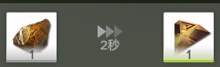
><精炼炉>
铜矿石 -> 黄三角
>制造：
使用：

- 黄粉
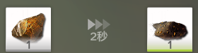
><粉碎机>
铜矿石 -> 黄粉
>制造：
使用：

- 发光黄块
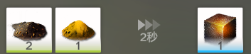
><研磨机>
黄粉 + 砂叶粉 -> 发光黄块
2 + 1 ->  1（2s）
>制造：3
使用：3

- 黄方块
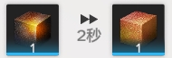
><精炼炉>
发光黄块 -> 黄方块
>制造：
使用：

- 绿色三角
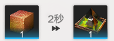
><精炼炉>
黄方块 -> 绿色三角
>制造：
使用：

# 
紫矿石
- 紫纤维
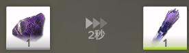
><精炼炉>
紫矿石 -> 紫纤维
>制造：
使用：

- 紫粉
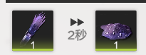
><粉碎机>
紫纤维 -> 紫粉
1 -> 1（2s）
>制造：
使用：

- 紫零件 

><配装机>
紫纤维 -> 紫零件
1 -> 1（2s）
>制造：
使用：

- 白块
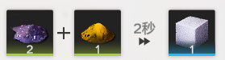
><研磨机>
紫粉 + 砂叶粉 -> - 白块
2 + 1 ->  1（2s）
>制造：
使用：

- 白围巾
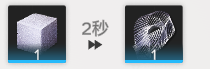
><精炼炉>
白块 -> 白围巾
1 -> 1（2s）
>制造：
使用：

- 白零件
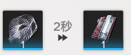
><配件机>
白围巾 -> 白零件
1 -> 1（2s）
>制造：
使用：

# 
蓝矿石
- 蓝块
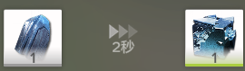
><精炼炉>
蓝矿石 -> 蓝块
1 -> 1（2s）
>制造：
使用：

- 蓝粉
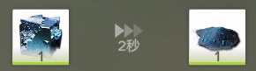
><粉碎机>
蓝块 -> 蓝粉
1 -> 1（2s）
>制造：
使用：

- 蓝粉块
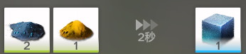
><研磨机>
蓝粉 + 砂叶粉 -> 蓝粉块
2 + 1 ->  1（2s）
>制造：
使用：

- 蓝星块
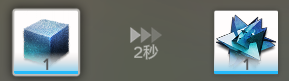
><精炼炉>
蓝粉块 -> 蓝星块
1 -> 1（2s）
>制造：
使用：

- 铁零件
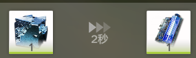
><配件机>
蓝块 -> 铁零件
>制造：
使用：

- 钢零件
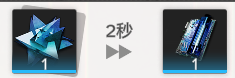
><配件机>
蓝星块 -> 钢零件
>制造：   
使用：

