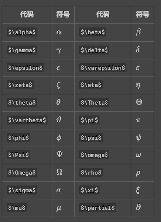

# <center>-----关系符号-----
|作用       |代码               |符号|
|:---:      |:---:              |:---:|
|不等于	    |\not (斜杠)	    |$\not =$
|约等于     |\approx	        |$\approx$ 
|小于等于   |\leq	            |$\leq $ 
|大于等于	|\geq	            |$\geq$ 
|叉乘	    |\times	            |$\times$ 
|点乘	    |\cdot	            |$\cdot$ 
|加或减	    |\pm	            |$\pm$ 
|除	        |\div	            |$\div$  
|无限	    |\infty	            |$\infty$ 
|连续求和   |\sum	            |$\sum$
|连续求积   |\prod	            |$\prod$
|不相交并   |\coprod	        |$\coprod$  
|上箭头	    |\uparrow	        |$\uparrow$ 
|下箭头	    |\downarrow	        |$\downarrow$ 
|左箭头	    |\leftarrow	        |$\leftarrow$ 
|右箭头	    |\rightarrow	    |$\rightarrow$ 
|平均数	    |\overline{a+b+c}   |$\overline{a+b+c}$ 


# <center>-----集合-----
|作用       |代码               |符号|
|:---:      |:---:              |:---:|
|属于	    |\epsilon           |$\epsilon$
|空集	    |\emptyset	        |$\emptyset$ 
|属于	    |\in	            |$\in$ 
|不属于	    |\notin	            |$\notin$ 
|包含	    |\supset	        |$\supset$ 
|真包含	    |\supseteq	        |$\supseteq$ 
|交集	    |\bigcap	        |$\bigcap$ 
|并（全）集	|\bigcup	        |$\bigcup$ 
|析取	    |\bigvee	        |$\bigvee$ 
|合取	    |\bigwedge	        |$\bigwedge$ 


# <center>-----上下标-----
|作用       |代码               |符号|
|:---:      |:---:              |:---:| 
|上标	    |x^2	            |$x^2$ 
|下表	    |y_1	            |$y_1$ 
 

# <center>-----分数-----
|作用       |代码               |符号|
|:---:      |:---:              |:---:| 
|分数	    |1 \over 2	        |$1 \over 2$ 
|分数	    |\frac{1}{2}	    |$\frac{1}{2}$ 


# <center>-----开方-----
|作用       |代码               |符号|
|:---:      |:---:              |:---:|         
|开平方	    |\sqrt{}	        |$\sqrt{3}$
|开n方	    |\sqrt[n次方]{对象}	|$\sqrt[n]{3}$


# <center>-----向量-----
|作用       |代码               |符号|
|:---:      |:---:              |:---:|
|向量	    |\vec {ab}	        |$\vec {ab}$
        
# <center>-----极限-----
|作用       |代码                           |符号|
|:---:      |:---:                          |:---:|
|极限	    |\lim_{n\rightarrow+\infty}x	|$\lim_{n\rightarrow+\infty}x$
        
# <center>-----求导-----
|作用       |代码               |符号|
|:---:      |:---:              |:---:|
|求导	    |y \prime           |$y \prime$
        
# <center>-----对数-----
|作用       |代码               |符号|
|:---:      |:---:              |:---:|   
|对数	    |\log;\lg;\ln	    |/
        
# <center>-----三角函数-----
|作用       |代码               |符号|
|:---:      |:---:              |:---:|
|垂直	    |\bot	            |$\bot$
|角度	    |30^\circ	        |$30^\circ$
|角度符号	|\angle	            |$\angle$
|函数	    |\sin;\cos;\tan;\cot;\sec;\csc	|/
      

# <center>-----方程组-----
方程组
```   
y:\begin{cases} 
    x+y=1\\
    x-y=0 
\end{cases}	
```
$
y:
\begin{cases} 
    x+y=1\\
    x-y=0 
\end{cases}
$

        
# <center>-----矩阵-----
矩阵
```
A=	
    \left[	
    \begin{matrix}
        1&2&3\\
        4&5&6\\
        7&8&9\\
    \end{matrix}
    \right]
```
$
A=	
    \left[	
    \begin{matrix}
        1&2&3\\
        4&5&6\\
        7&8&9\\
    \end{matrix}
    \right]
$

# <center>-----积分-----
|作用       |代码               |符号|
|:---:      |:---:              |:---:|
|一次定积分	|\int	            |$\int$
|三次定积分	|\iiint	            |$\iiint$
|闭合积分	|\oint	            |$\oint$


# <center>-----希腊字母标-----


|代码               |符号|
|:---:              |:---:|
|\Delta	            |$\Delta $
|                   |
|                   |
|                   |
