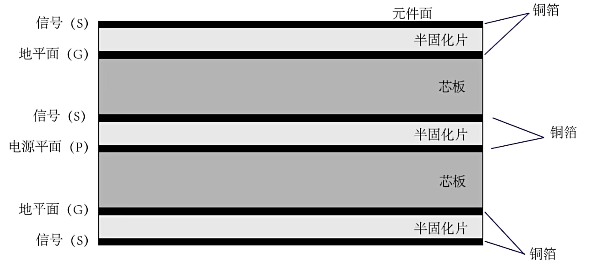

# 原则
- 每条信号线都要有最小阻抗的回流路径
- 相邻的电源-地平面层保持最小间距
- 大面积完整的参考层有电磁屏蔽效果

# 阻抗匹配

- 介电常数
- 介质厚度
- 铜箔厚度
- 走线宽度与间距

# 六层设置建议
S信号
G地平面
S信号
P电源平面F
G地平面
S信号

# 电源滤波
运放的电源滤波不容忽视，电源的好坏直接影响输出。

特别是对于高速运放，电源纹波对运放输出干扰很大，弄不好就会变成自激振荡。

所以最好的运放滤波是在运放的电源脚旁边加一个0.1uF的去耦电容和一个几十uF的担电容，或者再。串接一个小电感或者磁珠，效果会更好。

# 铺铜：
放运放的那一层最好是不覆铜，如果覆铜，运放的反相输入端和输入端与GND覆铜之间产生的寄生电容会引起运放自激振荡和不稳定

# 走线长度：
FR4 信号传递速度：
6 inch/ns
15 cm/ns
延迟时间大于20ns就会出现信号完整性问题
（100M，对应1200 mil长度）

# 反射
原因：阻抗的不连续
影响：对原有的波形进行叠加

阻抗关系：
信号源内阻
传输线的特征阻抗
接收端电阻

反射系数:Reflection Coefficient
$$\Gamma  = \frac{V_f}{V_i} = \frac{Z_L - Z_o}{Z_L + Z_o}$$

传输系数：Transmission Coefficient
$$T = \frac{V_o}{V_i} = \frac{2Z_L}{Z_L + Z_o}$$

$V_f $：反馈电压
$Z_L $：负载阻抗
$Z_o $：特性阻抗

当$R_o$很大时，反馈系数为1，相当于将所有信号反射回去了。此时，传输系数为2，输出为输入的两倍。

> 可以用于理解 信号发生器（50/高阻） 与 示波器（高阻） 的关系

如果两个电阻离得非常近，可以等效为一个电阻（例如：10+40ohm），因为反射效果比较弱。

# 特别
低速信号 $\not = $ 低频信号（可能有高频）
 