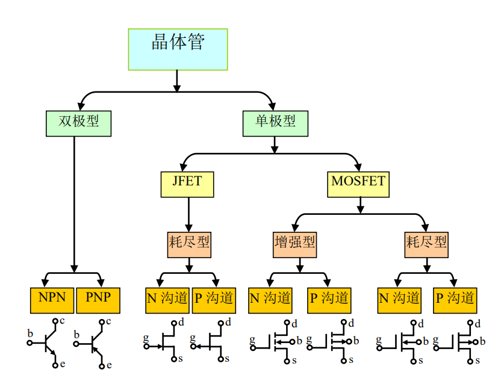

# 
晶体管分类(Transistor)

晶体管可大致分为：
- 双极型晶体管
- 单极型晶体管

>通过空穴或电子运动形成电流，只有一者参与为单极，都参与为双极

## 双极型晶体管(BJT)
>
(Bipolar Junction Transistor)

BJT可分为：
NPN 型、PNP 型

## 单极型晶体管(场效应管,FET)
>
(Field Effect Transistor)

FET可分为
结型管(JFET)和 金属氧化物管(MOSFET)