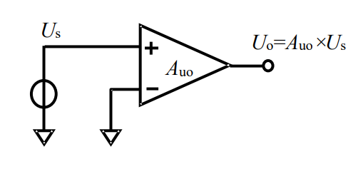
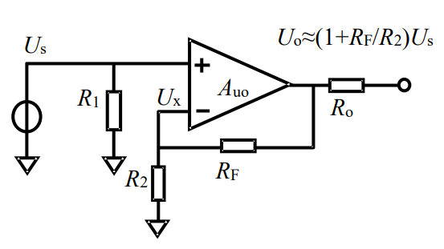
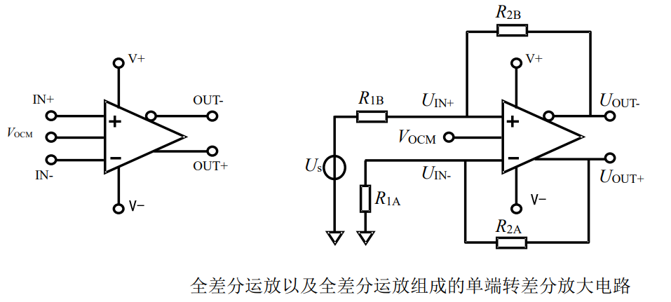

# 
运算放大器(OP放大器)
> 
(Operational Amplifier)

## 
一般OP开闭环特性

### 开环特性

1） 运放的开环增益 $A_{u_o}$ 非常大 
2） 运放的输入端没有电流，即运放具有极高的输入阻抗。

### 闭环特性

有以下式子成立：
$$
\begin{cases}
U_o = A_{u_o} (U_s - U_x)    \\
U_x = U_o \frac{R_2}{R_2 + R_F}
\end{cases}
$$

通过上式，可以得到任意两个未知量之间的关系：
$$
A_{u_f} = \frac{U_o}{U_s} = \frac{A_{u_o}}{1 + A_{u_o} \frac{R_2}{R_2 + R_F}}
$$
$$
U_x = U_s \frac{A_{u_o} R_2}{R_2 + R_F + A_{u_o} R_2}
$$

> $A_{u_f}$ 为闭环增益

显然，因为开环增益 $A_{u_o}$ 非常大，所以：
$$
A_{u_f} = \frac{R_2 + R_F}{R_2} = \frac{R_F}{R_2} + 1
$$
$$
U_x = U_s
$$

## 
全差分运放

有以下式子成立：
$$
\begin{cases}
U_{OUT+} - U_{OUT-} = A_{u_o} (U_{IN+} - U_{IN-})    \\
V_{OCM} = \frac{U_{OUT+} - U_{OUT-}}{2}
\end{cases}
$$

> $V_{OCM}$ 可以理解为输出偏置
