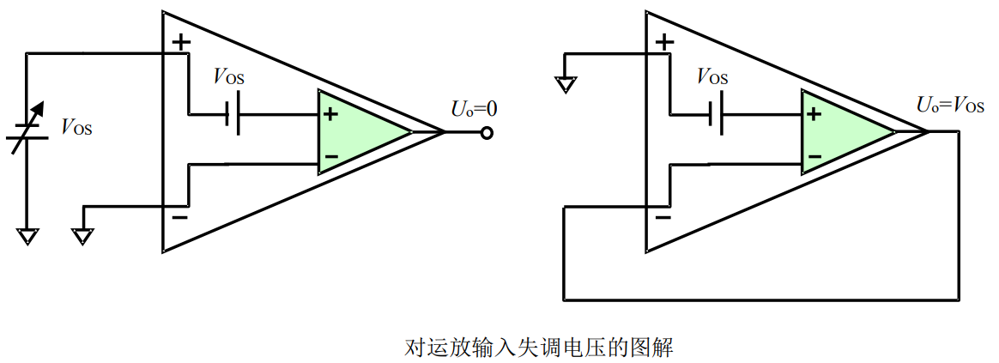

# 
 输入失调电压($V_{os}$)
> 
Input Offset Voltage

## 定义：
在运放开环使用时，加载在两个输入端之间的直流电压使得放大器直流输出电压为0。
也可定义为当运放接成跟随器且正输入端接地时，输出存在的非 0 电压。 

## 优劣范围：
1µV 以下，属于极优秀的
100µV 以下的属于较好的
最大的有几十mV。 

## 示意图：
任何一个实际运放都可理解为正端内部串联了一个 $V_{os}$ ，然后进入一个理想运放

## 后果：
当一个放大器被设计成 $A_f$倍闭环电压增益（同相输入放大增益，也称噪声增益）时，如果放大器的失调电压为 $V_{os}$ ，则放大电路 0 输入时，输出存在一个等于 $A_f V_{os}$ 的直流电平，此输出被称为输出失调电压。闭环增益越大，则输出失调电压也越大。 

## 对策：
如果被测信号包含直流量且你关心这个直流量，就必须选择 $V_{os}$ 远小于被测直流量的放大器，或者通过运放的调零措施消除这个影响。如果你仅关心被测信号中的交变成分，你可以在输入端和输出端增加交流耦合电路，将其消除。 

## 调零方法：
有些运放有两个调零端，按照数据手册提供的方法接电位器调零即可。对没有调零端的运放，可采用外部的输出调零或者输入调零，有标准电路可以参考。