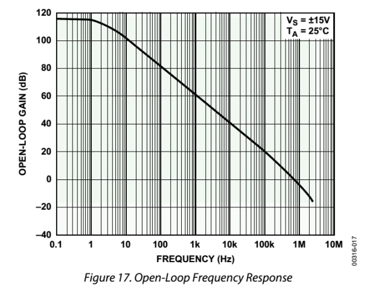

# 
 开环电压增益($A_{vo}$)
> 
Open-loop Gain

## 定义：
运放本身具备的输出电压与两个输入端差压的比值，用 dB 表示。 

## 优劣范围：
一般在 60dB~160dB 之间。越大的，说明其放大能力越强。

## 理解：
开环电压增益是指放大器在闭环工作时，实际输出除以运放正负输入端之间的压差，类似于运放开环工作——其实运放是不能开环工作的。 

应该是0.0：
$$
A_{vo} = \frac{u_o}{u_+ - u_-}
$$

AVO 随频率升高而降低，通常从运放内部的第一个极点开始，其增益就以-20dB/10 倍频的速率开始下降，第二个极点开始加速下降。

## 示意图：
OP07开环增益与信号频率关系

## 后果：
在特殊应用中，比如高精密测量、低失真度测量中需要注意此指标。在某个频率处实际的开环电压增益，将决定放大器的实际放大倍数与设计放大倍数的误差，也将决定放大器对自身失真的抑制，还将影响输出电阻等。