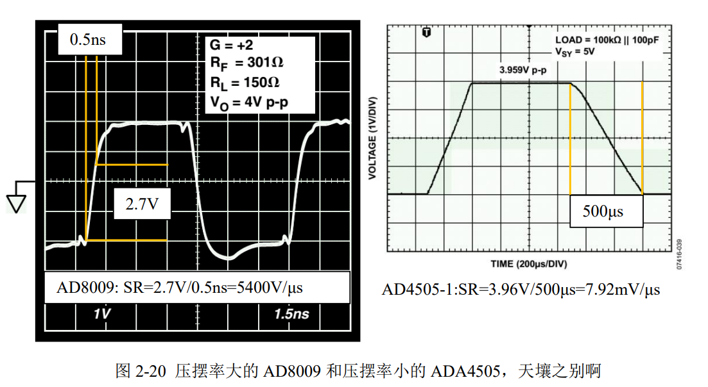

# 
 压摆率($SR$)
> 
Slew Rate

## 定义：
闭环放大器输出电压变化的最快速率。用 V/μs 表示。

## 优劣范围：
从 2mV/μs 到 9000V/μs 不等。

## 理解：
SR显示运放正常工作时，输出端所能提供的最大变化速率，当输出信号欲实现比这个速率还快的变化时，运放就不能提供了，导致输出波形变形——原本是正弦波就变成了三角波。 

对一个正弦波来说，其最大变化速率发生在过零点处，且与输出信号幅度、频率有关。设输出正弦波幅度为 $A_m$ ，频率为 $f_{out}$，过零点变化速率为$D_v$，则 
$$
D_v = 2 \pi A_m f_{out}
$$

要想输出完美的正弦波，则正弦波过零点变化速率必须小于运放的压摆率。即
$$
SR > D_v
$$

> 这个指标与满功率带宽有关

## 示意图：

