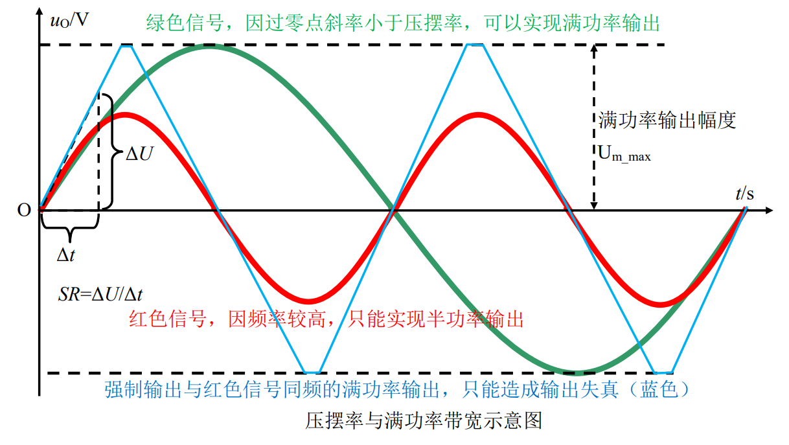
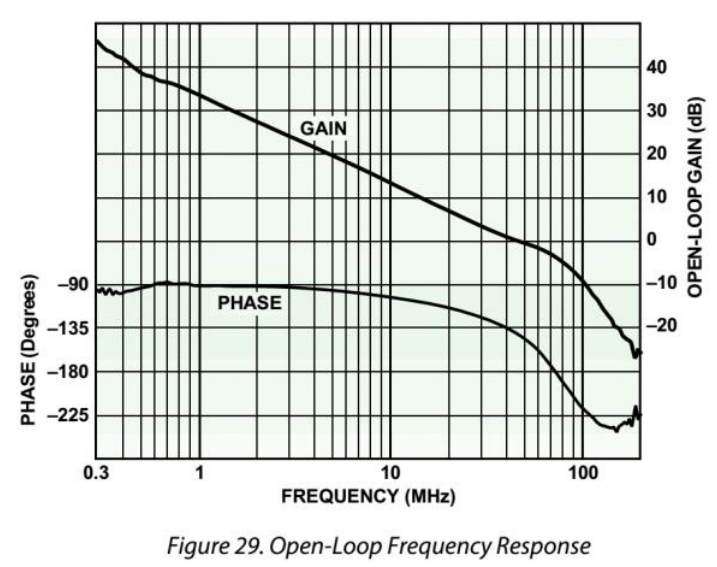
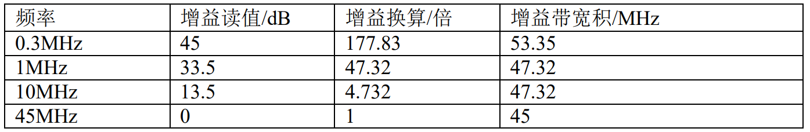
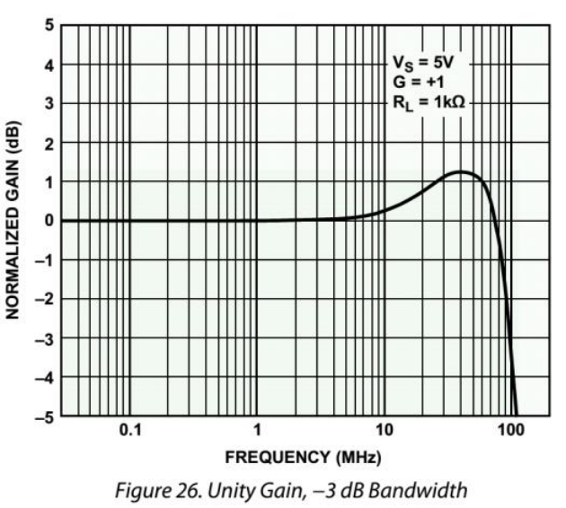

# 
 带宽指标
> 
Bandwidth

# 
单位增益带宽 $f_{UGBW}$
> 
Unity Gain Bandwidth，UGBW

## 定义：
运放开环增益/频率图中，开环增益下降到 1 时的频率。

## 理解：
当输入信号频率高于此值时，运放的开环增益会小于 1，即此时放大器不再具
备放大能力。这是衡量运放带宽的一个主要指标。 

# 
增益带宽积 $f_{GBP}$
> 
Gain Bandwidth Product，GBP/GBW

## 定义：
如果运放开环增益始终满足-20dB/10 倍频，也就是频率提高 10 倍，开环增益变为 0.1 倍，那么它们的乘积将是一个常数，也就等于前述的“单位增益带宽”，或者“1Hz处的增益”。

在一个相对较窄的频率区域内，增益带宽积可以保持不变，基本满足 -20dB/10 倍频的关系，我们暂称这个区域为增益线性变化区。

## 理解：
当输入信号频率高于此值时，运放的开环增益会小于 1，即此时放大器不再具备放大能力。这是衡量运放带宽的一个主要指标。 

# 
-3dB 带宽 $f_{dB}$

## 定义：
运放闭环使用时，某个指定闭环增益（一般为 1 或者 2、10 等）下，增益变为低频增益的 0.707 倍时的频率。

分为小信号（输出 200mV 以下）大信号（输出 2V）两种。 

## 理解：
它直接指出了使用该运放可以做到的-3dB 带宽。因为前述的两个指标，单位增益带宽和增益带宽积，其实都是对运放开环增益性能的一种描述，来自开环增益/频率图。

而这个指标是对运放接成某种增益的放大电路实施实测得到的。

# 
满功率带宽 $f_{FPBW}$
> 
Full Power Bandwidth

## 定义：
将运放接成指定增益闭环电路（一般为 1 倍），连接指定负载，输入加载正弦波，输出为指标规定的最大输出幅度，此状态下，不断增大输入信号频率，直到输出出现因压摆率限制产生的失真（变形）为止，此频率即为满功率带宽。

> 失真时，波形一直以“SR（压摆率）的速度”上升，形似三角波

## 理解：
比-3dB 带宽更为苛刻的一个限制频率。

它指出在此频率之内，不但输出幅度不会降低，且能实现满幅度的大信号带载输出。

满功率带宽与器件压摆率密切相关：

$$
FPBW = \frac{SR}{2 \pi A_{max}}
$$

$A_{max}$ 为满功率值（运放能够输出的最大值）

## 示意图：
> 基于AD8031，图1

AD8031 的开环增益图如图 Figure 29，右侧纵轴是增益 GAIN/dB。

注意 0dB 发生在频率约为 45MHz 的地方，说明单位增益带宽为 45MHz。 

可以从图中看出：

这说明增益带宽积是变化的，在 45MHz 之前是大于单位增益带宽的。
但是这个结论没有普适性，只是个体呈现。

> 基于AD8031，图2

Figure26 是 AD8031 组成一个 1 倍增益放大电路后的幅频特性，0dB 发生在 75MHz处，-3dB 发生在大约 90MHz~100MHz 之间。

这说明它的-3dB 带宽为 90MHz 左右，大于单位增益带宽。 

> AD8031 的单位增益带宽 45MHz 和-3dB 带宽 90MHz
> 
> 请思考，为什么在 45MHz 处，开环增益为 1 倍，闭环增益却是 1.2dB 左右，即 1.148倍？这个放大能力从哪里来的？

## 大小关系：
一般情况下，
$f_{UGBW} < f_{GBP}$ ,但是相近，数据手册一般不会给出表格型指标

$f_{dB}$ 可能大可能小

$f_{FPBW}$ 一般远小于前三者

