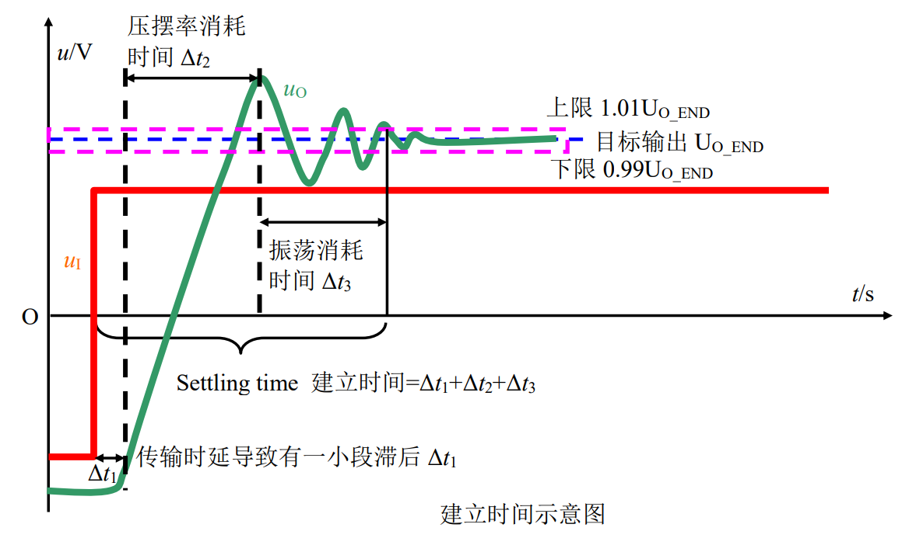

# 
 建立时间
> 
Setting Time

## 定义：
运放接成指定增益（一般为 1），从输入阶跃信号开始，到输出完全进入指定误差范围所需要的时间。所谓的指定误差范围，一般有 1%，0.1%几种。 

## 优劣范围：
几个 ns 到几个 ms

## 理解：
建立时间由三部分组成，第一是运放的延迟，第二是压摆率带来的爬坡时间，第三是稳定时间。很显然，这个指标与 SR 密切相关，一般来说，SR 越大的，建立时间更小。 

对运放组成的 ADC 驱动电路，建立时间是一个重要指标。

## 示意图：

