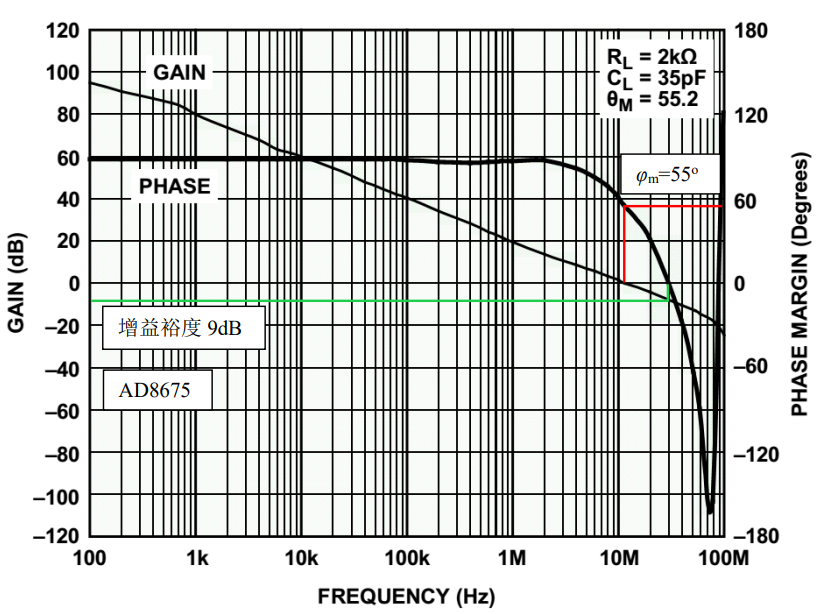

# 
 相位裕度($\varphi_m$)
> 
Phase margin

## 定义：
在运放开环增益和开环相移图中，当运放的开环增益下降到 1 时，开环相移值减去-180°得到的数值。

# 
 增益裕度

## 定义：
在运放开环增益和开环相移图中，当运放的开环相移下降到-180°时，增益 dB 值取负，或者是增益值的倒数。

## 理解：
相位裕度和增益裕度越大，说明放大器越容易稳定。 

## 示意图：

需要特别注意的是，很多器件在描述开环特性时，在相位图中纵轴存在定义标注不完全一致的现象，有的是正度数、有的是负度数——不同的定义有不同的解释，都合理。

但容易给读者造成混乱。我们需要注意的是，所有运放，在任何频率下，都只存在滞后相移，即相移为负值。在极低频率处，相移接近于 0 且小于 0，随着频率的上升，很快相移就进入到稳定的-90 度，然后走向-180 度甚至-270 度。

知道了这个规律，数据手册中无论怎么标注，你都能轻松应对了。 

这样理解，相位裕度其实就是当前相移和-180 度的距离。