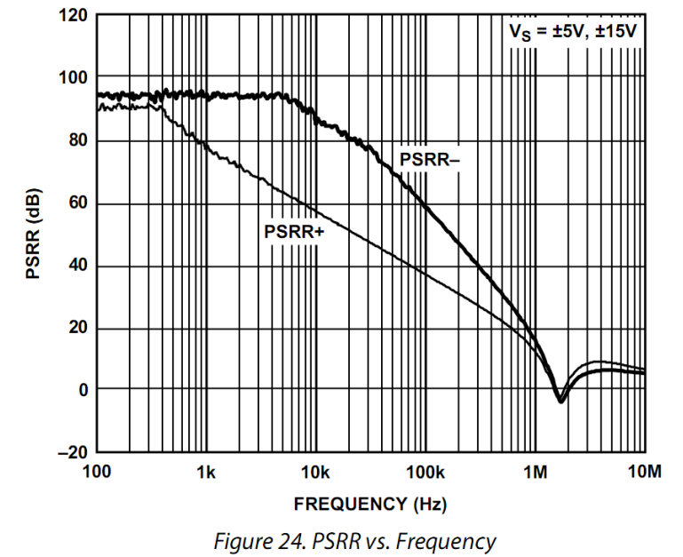

# 
 电源电压抑制比($PSRR$)
> 
Power Supply Rejection Ratio

## 定义：
双电源供电电路中，保持负电源电压不变，输入不变，而让正电源产生变化幅度为 $ΔV_S$，频率为$ f $的波动。那么在输出端会产生变化幅度为$ΔV_{out}$，频率为$ f $的波动。

这等效于电源稳定不变情况下，在入端施加了一个变化幅度为 $ΔV_{in}$，频率为 f 的波动。则:（单位dB）

$$
PSRR_+ = 20 log (\frac{\Delta V_s}{\Delta V_{in}})
$$

考虑到电路本身的噪声增益 $G_N$ ，则：

$$
PSRR_+ = 20 log (\frac{\Delta V_s \times G_N}{\Delta V_{out}})
$$

> 同样的方法，保持正电源电压不变，仅改变负电源电压，会得到 $PSRR_-$
>
> 有些运放在描述 PSRR 时，不区分单独改变某个电源电压，而仅给出 PSRR，这是指两个电源电压同时改变。
> 注意，两个电源的改变方向是相反的——即保持正负电源的绝对值相等。 

## 理解：

电源电压抑制比，其含义是运放对电源上纹波或者噪声的抵抗能力。

首先，正负电源具有不一定相同的 PSRR.

其次，随着电源电压变化频率的提升，运放对这个变化的抵抗能力会下降。

一般情况下，电源变化频率接近其带宽时，运放会失去对电源变化的抵抗——即单位增益情况下电源变化多少，输出就变化多少。

> 这个指标与满功率带宽有关

## 示意图：
基于ADA4000-1

频率越高，运放对电源纹波或者噪声的抵抗能力越弱，这导致运放电路的输出端会出现电源上的不干净因素。

旁路电容的作用就是滤除电源上的噪声或者波动，特别在高频处，更需要滤除。
