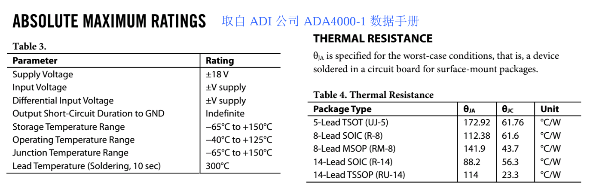

# 
 热阻($\theta_{JA}$)和温度范围
> 
Thermal Resistance

## 定义：
热阻标准定义：是导热体阻止热量散失程度的描述，以1W发热源在导热路径两端形成的温度差表示，单位为℃/W。有以下常用的两种：

$θ_{JA}$，是指芯片热源结(Junction)与芯片周围环境(Ambient)（一般为空气）的热阻。

$θ_{JC}$，是指芯片热源结(Junction)与芯片管壳(Case)的热阻。 

## 理解：
对芯片来说，导热路径的两端分别为自身发热体与环境空气。热阻$θ_{JA}$越大，说明散热越困难，其温差也就越大。 

比如一个热阻 $θ_{JA}=150 ℃/W$ 的芯片，说明其如果存在1W的热功率释放（为电源提供给芯片的功率-芯片输出的功率），则会在芯片内核和环境空气中形成一个150℃的温差。 

当确定热功率释放为P，则:

$$
\Delta T = P \times θ_{JA}
$$

其中ΔT是芯片工作时，自身结温与环境温度的温差。如果此时环境温度为$T_A$，则芯片结温$T_J$为： 

$$
J = 𝑇_A +∆𝑇 
$$

很显然，同样功耗情况下，具有不同热阻的芯片，热阻越大的，结温会越高。 

当结温超过了最高容许结温（一般就是芯片中声明的存储温度，比如150℃），芯片就可能发热损坏。 

应用热阻指标可以帮助设计者估算芯片可否安全工作。

如下图查到ADA4000-1关于热阻的描述，可知SOIC8封装热阻为112.38℃/W，结温不得超过150℃。假设设计者使用SOIC8 封装，则在-10~50℃环境下（一般气温范围），为保证结温不超过150℃，ΔT需小于100℃。

因此，设计电路时，需要注意ADA4000-1的发热功耗不得超过:

$$
P < \frac{∆𝑇}{𝜃_{JA}} = 889.8mW 
$$

而发热功耗与输出功率相关，一般情况下，输出功率越大，会带来芯片本身发热功耗的增加。

当然，对ADA4000-1来说，产生如此大的发热功耗是不可能的，对于高频运放则
很正常。

可以看出，选择热阻更小的14脚封装的SOIC(也就是SO-14)，具有88.2℃/W的热阻，则可以有效改善。 

理论上说，你看看芯片的大小（就能估计出热阻），摸摸芯片的温度，通过色环读出负
载电阻的大小，就可以粗略估计出输出电压幅度，看似很神奇，其实也很简单。

## 示意图：
