41# 
标题(Features)
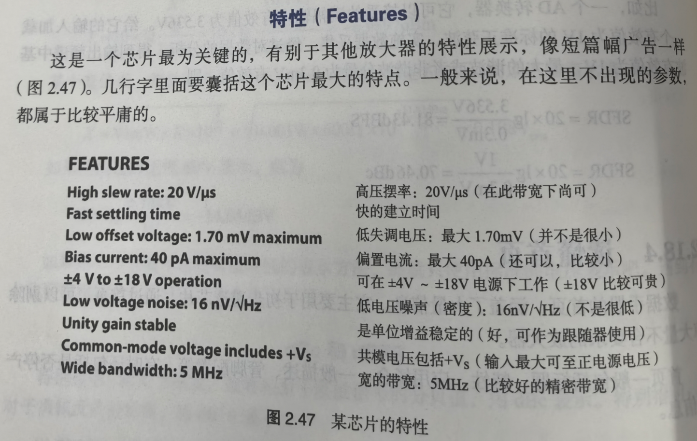

# 
应用场景(Applications)
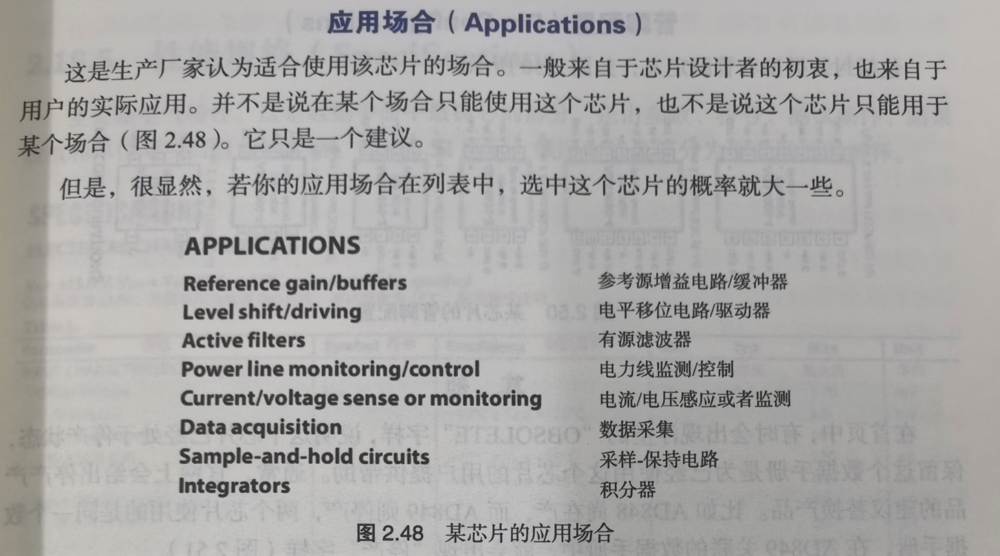

# 
一般描述(General Description)
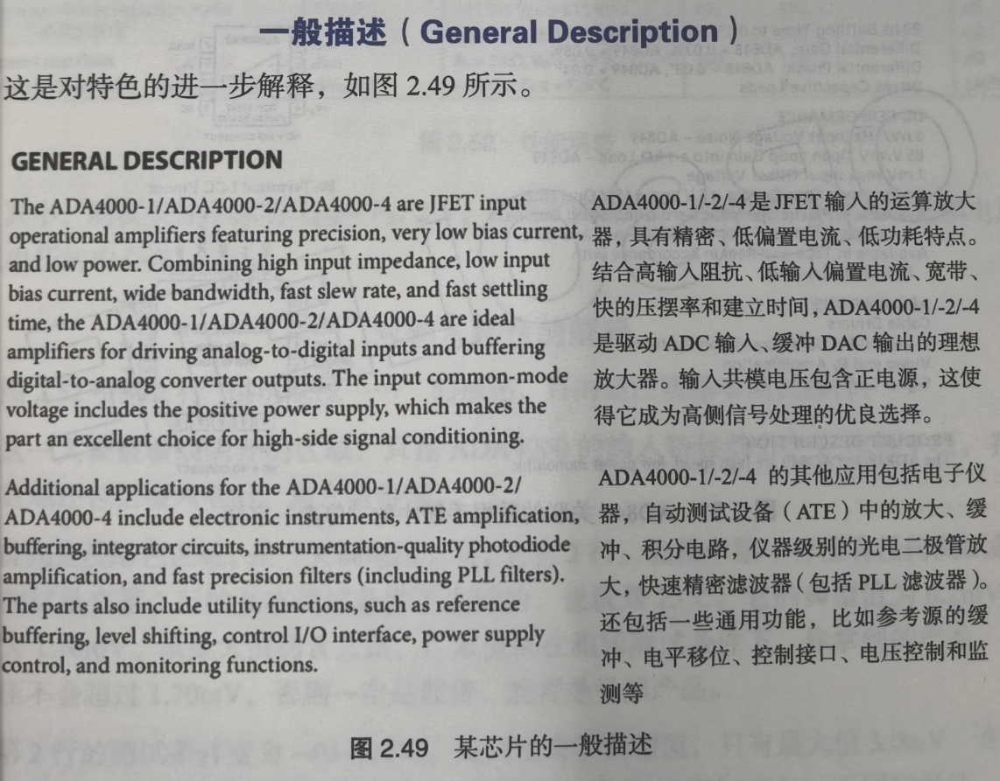

# 
管脚配置(Pin Configurations)
> 
    ==一眼秒了==

# 
停产(Obsolete)
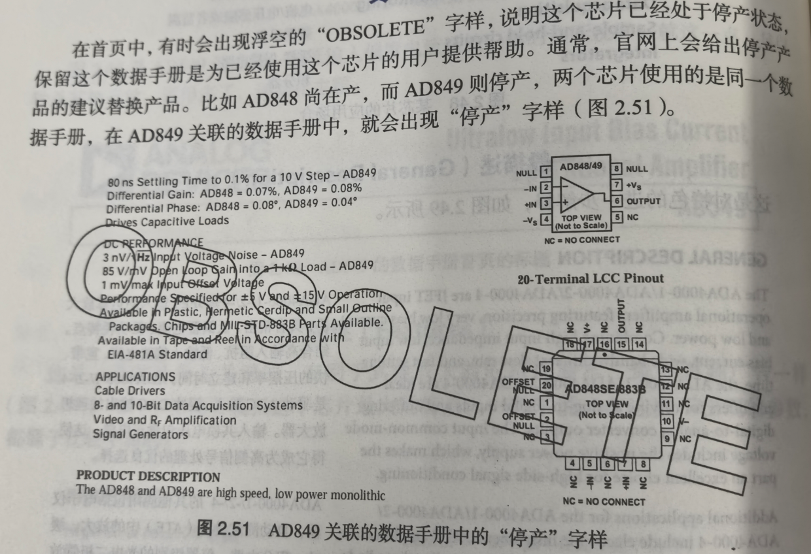

# 
性能规格(Specifications)
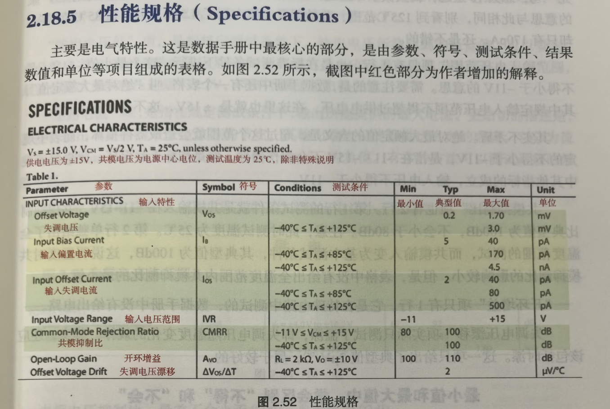

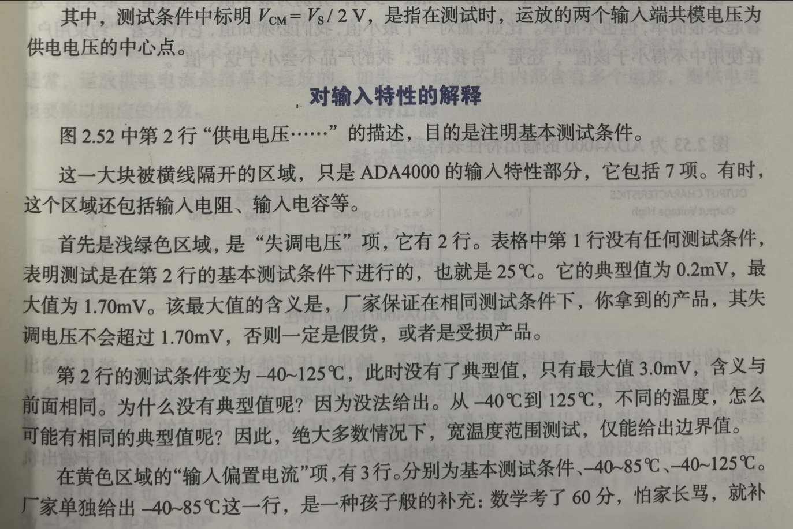

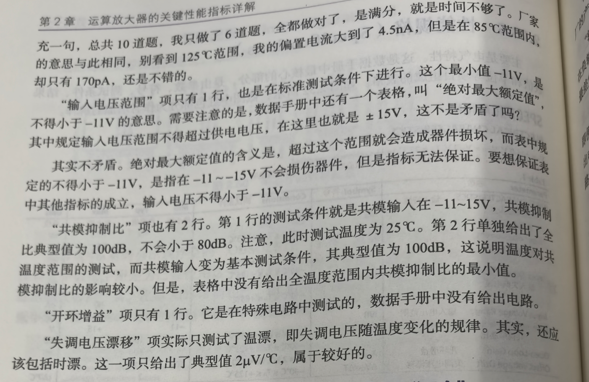

# 
输出特性(Output)
> 
2.8

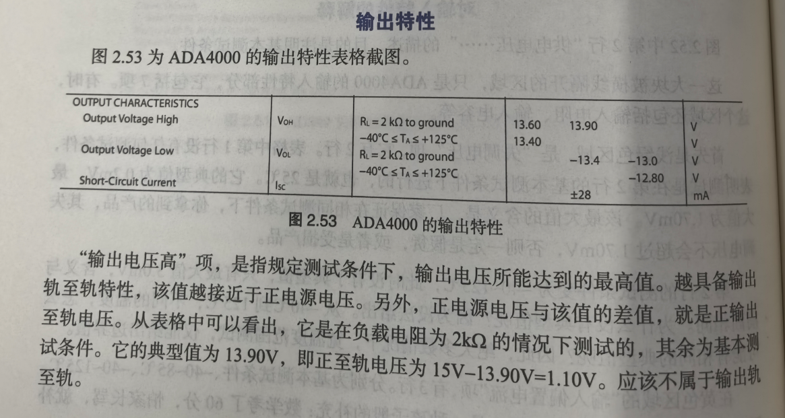

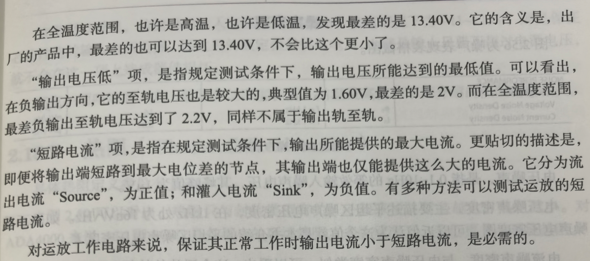

# 
供电(Power Supply)
> 
2.15

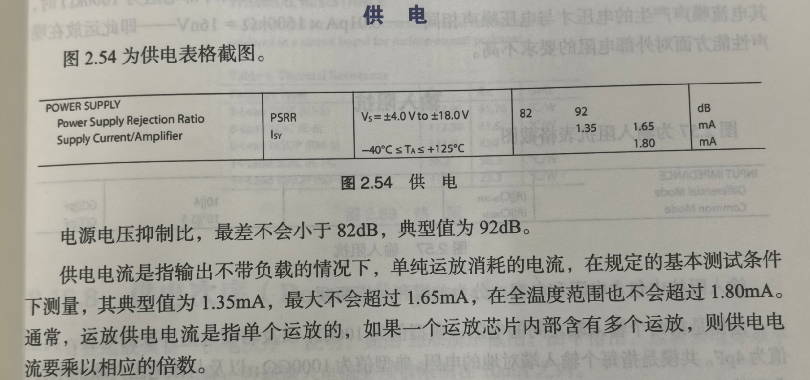

# 
动态表现(Dynamic Performance)
> 
2.11、2.12、2.14

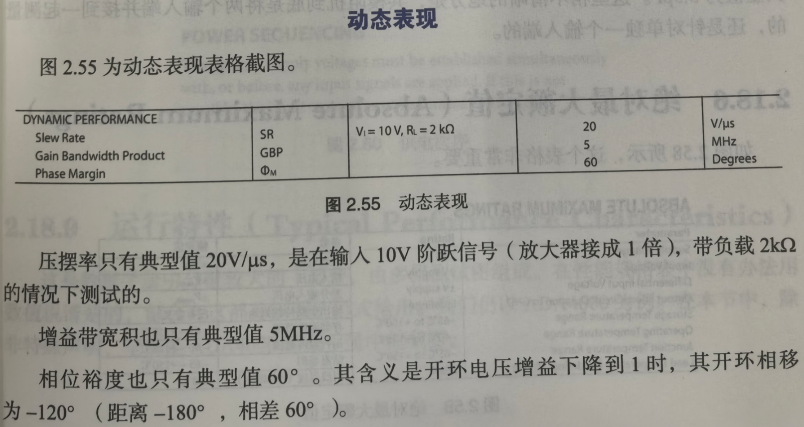

# 
噪声表现(Noise Performance)
> 
2.6

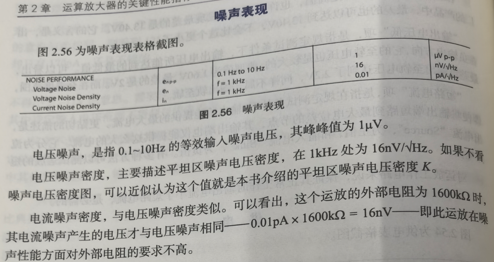

# 
输入阻抗(Input Impendance)
> 
2.9

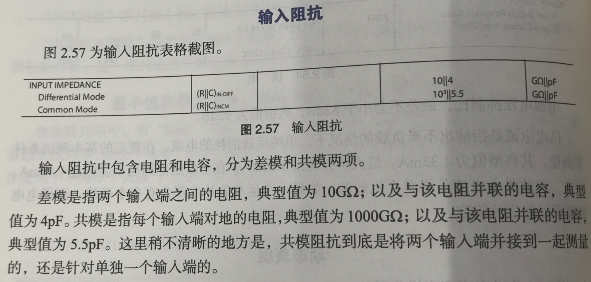

# 
绝对最大额定值(Absolute Maximum Ratings)
> 
important

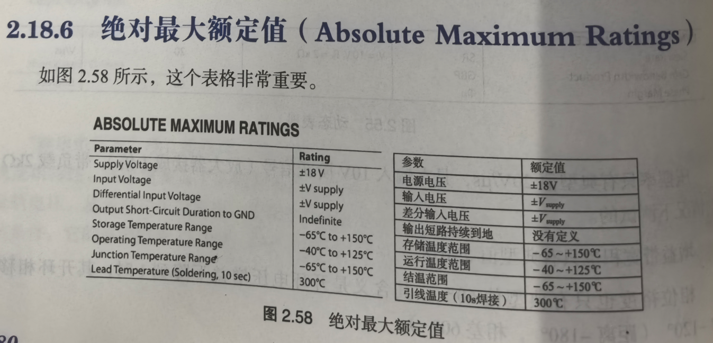

这里可以看出，前面讲的输入电压范围在±15V供电情况下为-11~+15V，那是保证芯片性的输入电压范围。

而这里的额定值是供电电压，也就是输入只要不超过电源电压，就不会在这一项上造成器件损坏。

还有一项叫结温。它一般与存储温度相同。结温最高值与下面介绍的热阻密切相关。

# 
热阻(Thermal Resistance)
> 
2.17

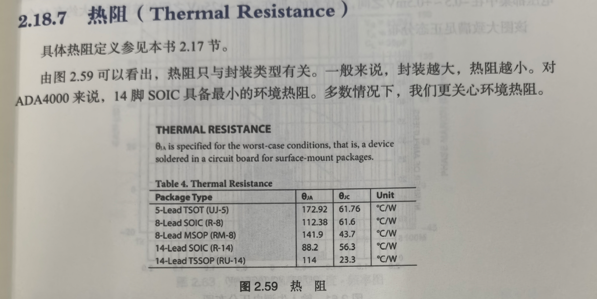

# 
供电次序(Power Sequencing)

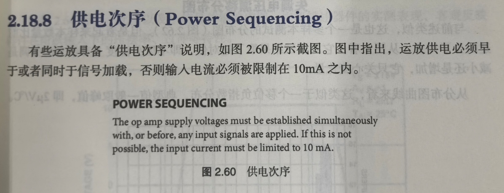

