## 
运行特性(Typical Performance Characteristics)

基于ADA4000

# 
输入失调电压分布图
> 
2.1

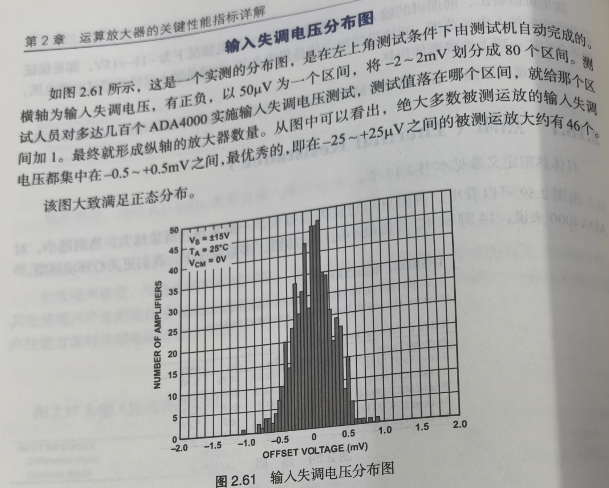

# 
失调电压漂移分布图
> 
2.2

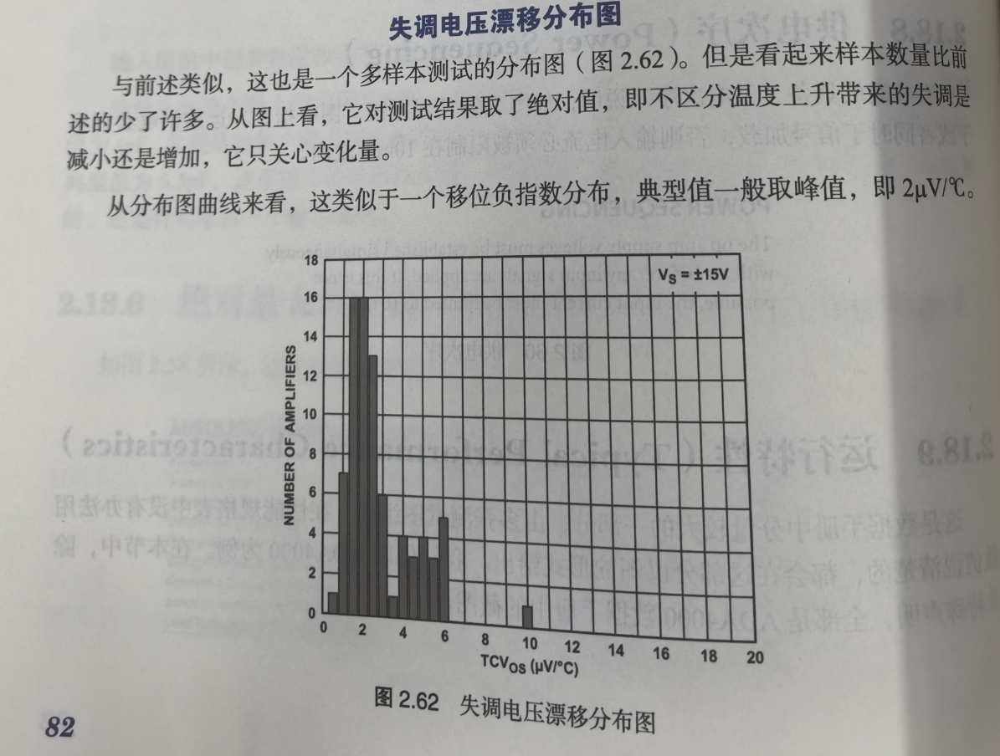

# 
开环增益和相位裕度 - 频率图
> 
2.10、2.14

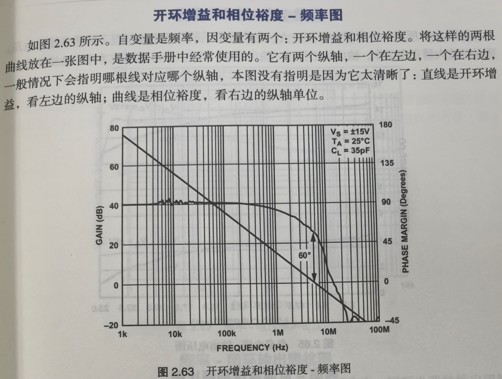

# 
大信号传输响应图

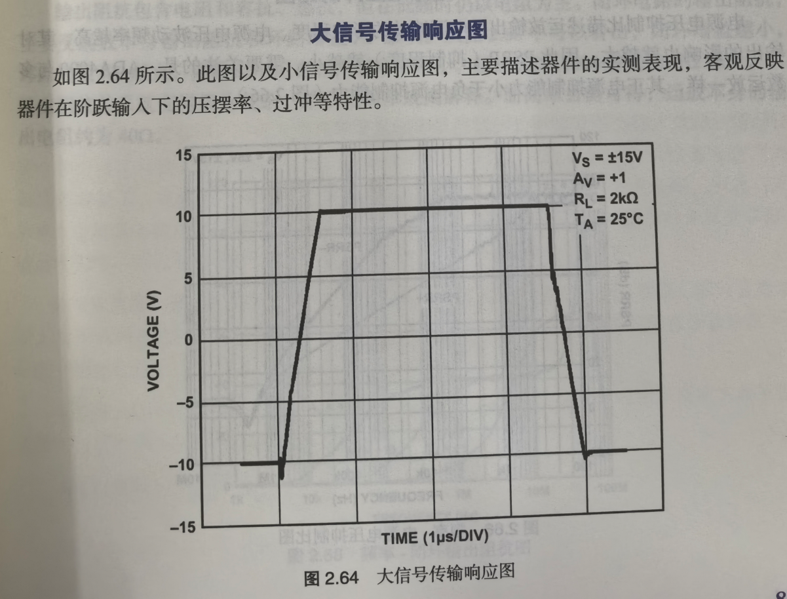

# 
负载电流 - 输出电压图
> 
2.8

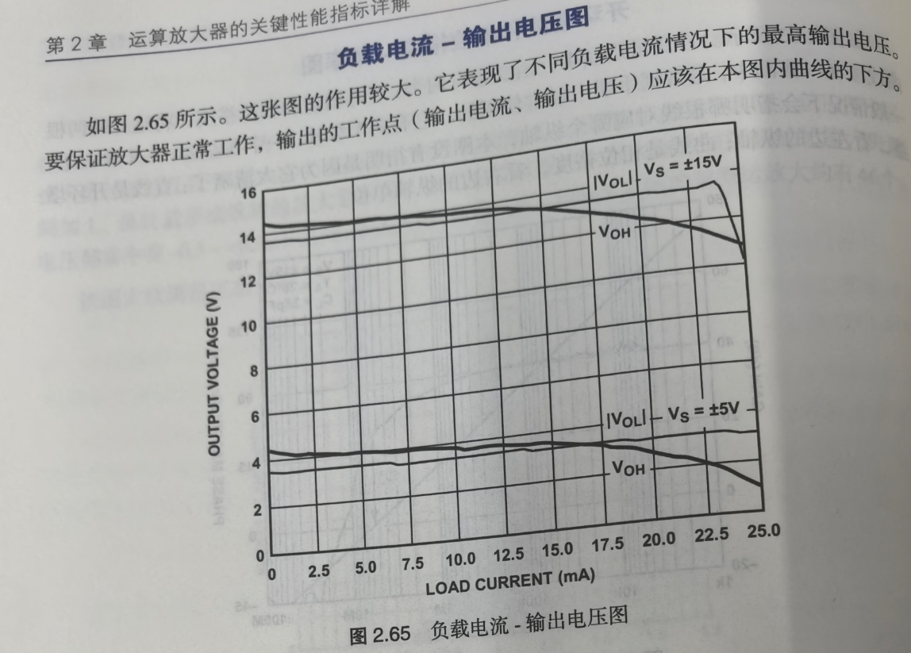

# 
频率 - 电源电压抑制比图
> 
2.15

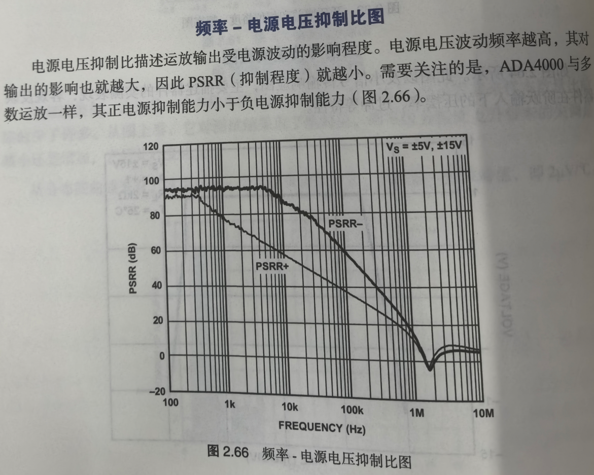

# 
频率 - 噪声密度图
> 
2.6

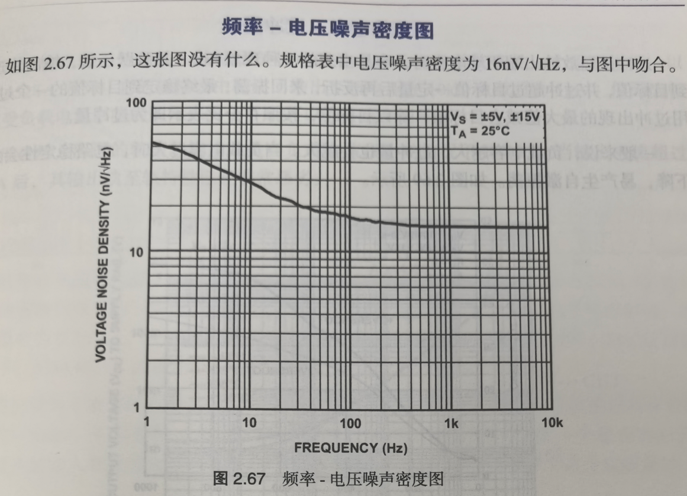

# 
频率 - 闭环输出阻抗图

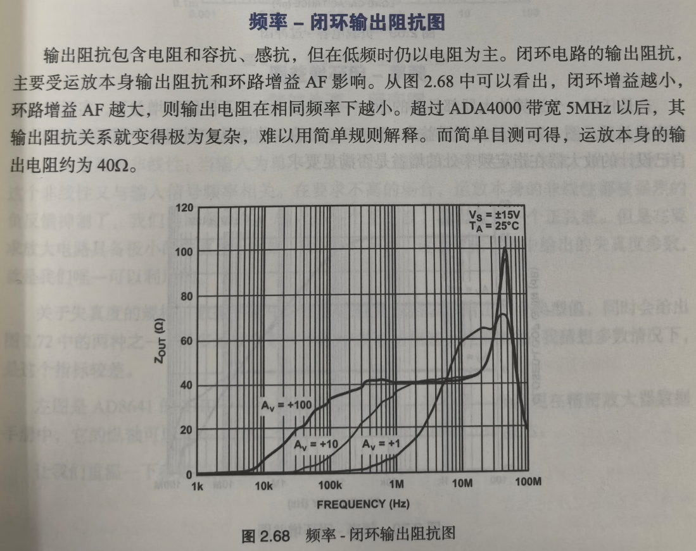
 

# 
负载电容 - 过冲图

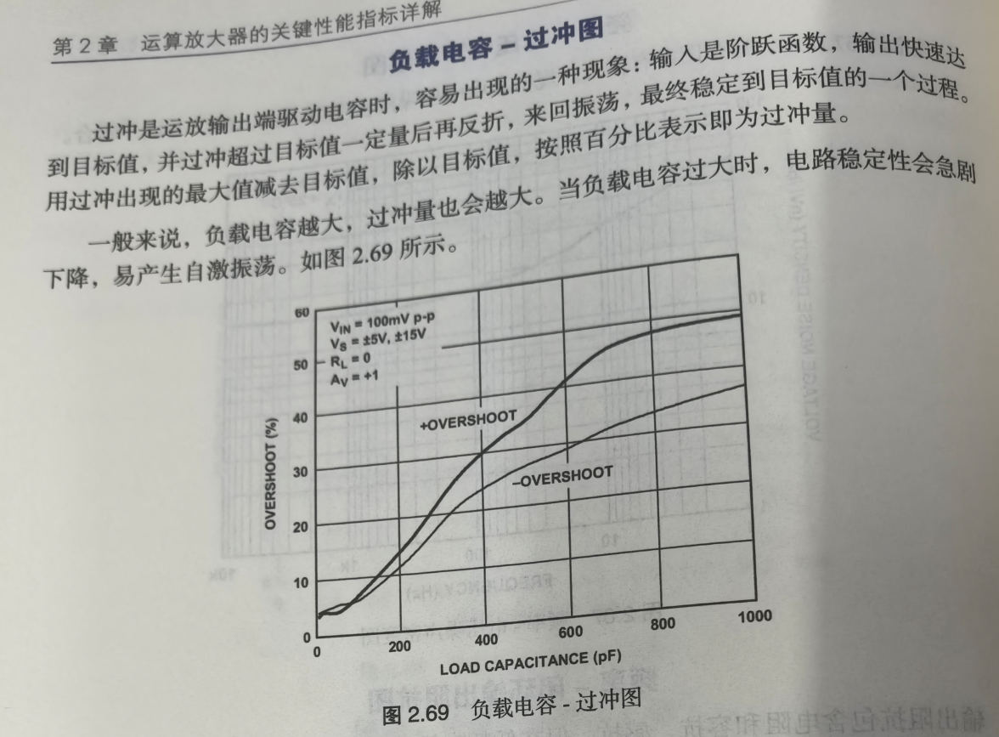

# 
频率 - 闭环增益图

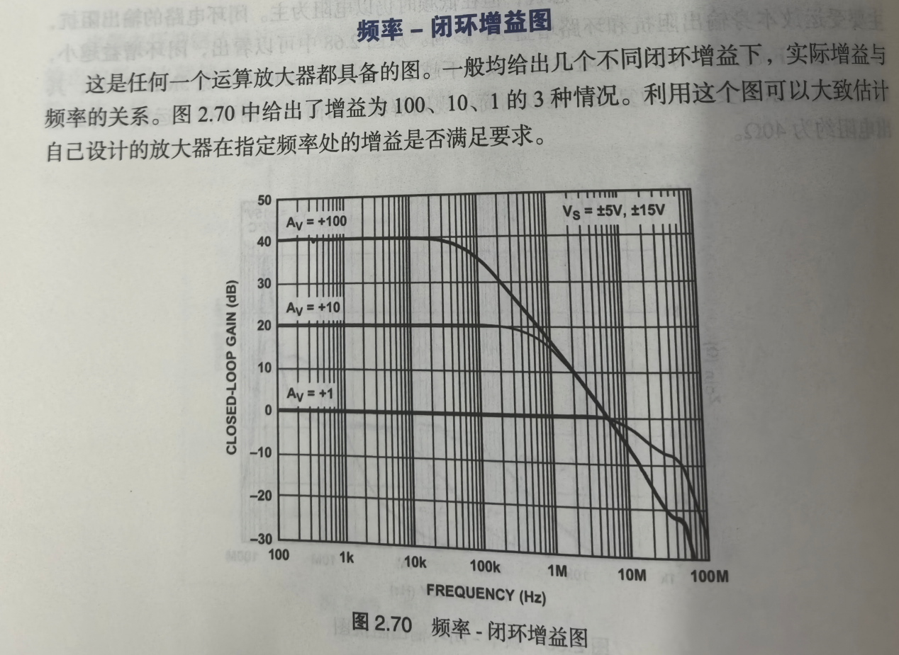

# 
负载电流 - 至轨电压图

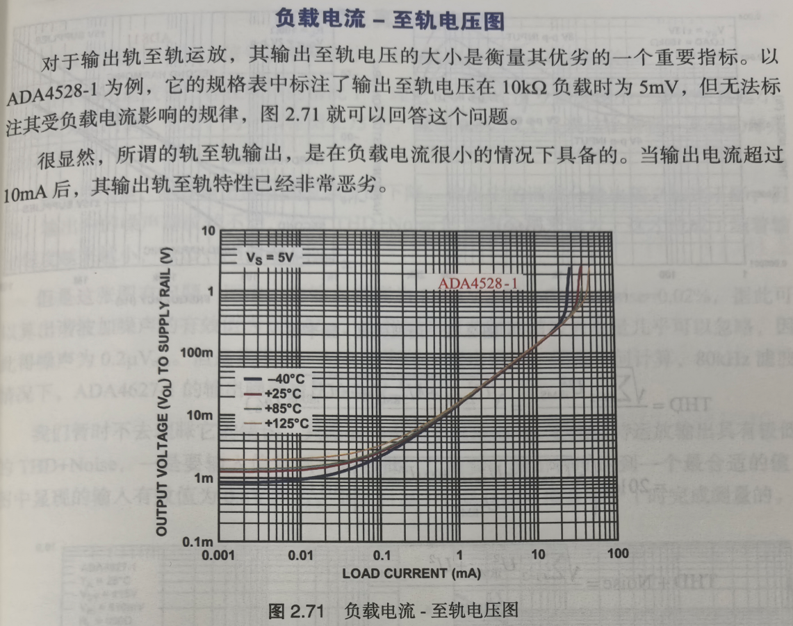

# 
谐波失真 - 频率图
> 
2.16

从静态来讲，运放的开环增益不是恒定不变的，与净输人电压有关，这导致运放的输入输出关系具有非线性:当输入为单一正弦波时，输出就会产生谐波失真。
从动态来讲，这个非线性又与输人信号频率相关。
在要求不高的场合，运放本身的非线性都被强烈的负反馈抑制了，我们肉眼看到的，输人是一个正弦波，输出也是一个正弦波。
但是在要求放大电路具备极小的失真度，比如-100dB以下时，运放数据手册中给出的失真度参数，就是我们唯一可以利用的。

关于失真度的规格，数据手册中一般会在性能规格表中给出一个典型值，同时会给出图2.72中的两种之一。
很多运放在数据手册中没有给出这个性能规格，我猜想多数情况下，是这个指标较差。

左图是AD8641的THD+Noise随频率变化曲线。这类图一般出现在精密放大器数据手册中，它的纵轴可以用%表达，也可以用dB或者指明的dBc表达。

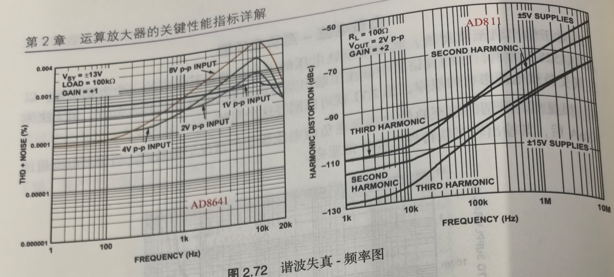

其实，都在表达这样一个概念:不期望出现的，或者是谐波分量，或者是谐波分量加上噪声，它们的有效值与输人基波的有效值的比值。
至于用%还是dBc表达，换算一下即可，比如1%就代表着-40dBc，0.0001%就代表着-120dBc。

从图中可以看出一些奇妙的地方，在低频段，输入幅度8V是失真最小的;
随着频率的提高，输人1V的失真变得最小。
因此，我们可以利用的规则只有，当幅度不变时，随着频率的增加，失真度是变大的。
除此之外，不要总结规律。

# 
谐波失真 - 幅度图
> 
2.16

谐波失真除了与输入信号频率有关外，还与输出信号幅度密切相关。

在不考虑运放输出存在噪声的情况下，理论上，输出信号幅度越小，谐波失真越小，这是毫无疑问的。
但是，为什么在图2.73中，除了0.8V以上呈现这个特性，其余的却是相反的呢?

根本原因是，随着输出信号基波幅度的下降，输出中的谐波分量也随之加速下降，但是，输出中的嗓声却纹丝不动，它对THD+Noise的影响会越来越大，这才造成了随着输出幅度越来越小，THD+Noise越来越大。

但是这张图有问题。
图中，在输人幅度为0.001Vrms时，THD + Noise = 0.02%，据此可以算出谐波加噪声的有效值为0.2uVrms，而我们知道此时的谐波失真量几乎可以忽略，因此得噪声为0.2uVrms。
但是我发现，ADI的资料一定出错了。
无论如何计算，80kHz滤波情况下，ADA4627-1的输出噪声也比0.2uVrms大。

我们暂时不去理睬它的错误，只需要知道这个道理即可:要想保持运放输出具有极低的THD + Noise，一是要输入信号频率足够低，二是要让输出幅度达到一个最合适的值，图中显现的输入有效值为0.8V左右，而资料显示它是在闭环增益等于1时完成测量的。

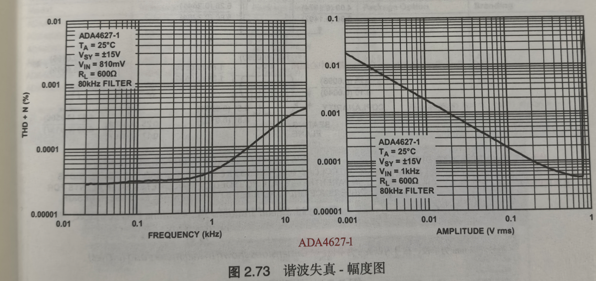

