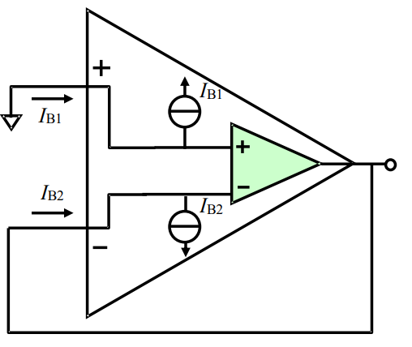

# 
 输入偏置电压($I_B$)
> 
Input Bias Current

## 定义：
当输出维持在规定的电平时，两个输入端流进电流的平均值。

## 优劣范围：
60fA~100µA。数量级相差巨大，这取决于运放输入端结构，FET 输入的会很小。

## 示意图：

$$
I_B = \frac{I_{B1} + I_{B2}}{2}
$$
运放的两个输入端并不是绝对高阻的，本项指标主要描述输入端流进电流的数量级。

## 后果：
第一，当用放大器接成跨阻放大测量外部微小电流时，过大的输入偏置电流会分掉被测电流，使测量失准。
第二，当放大器输入端存在电阻接地时，这个电流将在电阻上产生不小的输入电压。

## 对策：
为避免输入偏置电流对放大电路的影响，最主要的措施是选择 IB较小的放大器。有很多 FET 输入运放可以实现这个要求。 