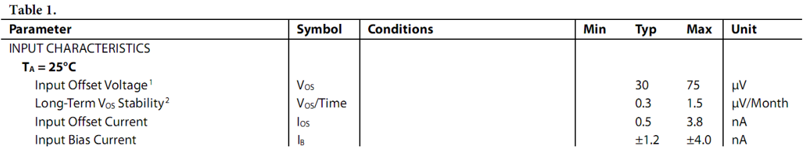
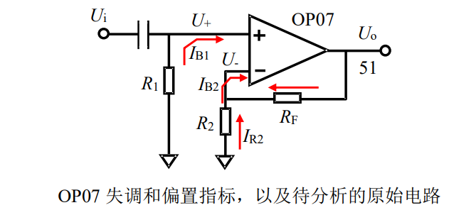

# 
 输入失调电压($V_{os}$)
> 
Input Offset Voltage

## 定义：
在运放开环使用时，加载在两个输入端之间的直流电压使得放大器直流输出电压为0。
也可定义为当运放接成跟随器且正输入端接地时，输出存在的非 0 电压。 

## 优劣范围：
1µV 以下，属于极优秀的
100µV 以下的属于较好的
最大的有几十mV。 

## 示意图：

## 分析：
$偏置电流I_B和输入失调电流I_{os}$ :

$$
\begin{cases}
I_B = \frac{I_{B1} + I_{B2}}{2}    \\
I_{os} = I_{B1} - I_{B2}
\end{cases}
$$

$输入失调电压V_{os}$ :

$$
\begin{cases}
U_o = A_{uo} (U_+ + V_{os} - U_-)   \\
U_+ = - I_{B1} R_1                  \\
U_- = - I_{R2} R_2 = - (I_{B2} - \frac{U_o - U_-}{R_F}) R_2
\end{cases}
$$

联立上面方程组，可得：
$$
U_o = \frac{A_{uo}}{1 + \frac{R_2}{R_2 + R_F} A_{uo}} (V_{os} + I_{B2} R_2 // R_F - I_{B1 R_1})
$$

$$
U_o = G_N (V_{os} + I_{B2} R_2 // R_F - I_{B1 R_1})
$$

> $G_N$ 被称为噪声增益

## 噪声增益$G_N$：

对于同相比例，其电压增益为：
$$
\frac{A_{uo}}{1 + \frac{R_2}{R_2 + R_F} A_{uo}} \approx \frac{R_F}{R_2} + 1
$$

对于反相比例，其电压增益为：
$$
\frac{-\frac{R_F}{R_2 + R_F} A_{uo}}{1 + \frac{R_2}{R_2 + R_F} A_{uo}} \approx -\frac{R_F}{R_2}
$$

但是，这两个电路在输入端接地时，是完全一样的。定义它们的同相输入电压增益为噪声增益：
$$
G_N = \frac{A_{uo}}{1 + \frac{R_2}{R_2 + R_F} A_{uo}} \approx \frac{R_F}{R_2} + 1
$$

之所以定义同相放大器增益为噪声增益，原因是，噪声源、失调电压源在运放分析中
都被定义在了同相输入端，它们确实会被放大$\frac{R_F}{R_2} + 1$倍。 

## 结论：
从式 2-1 可以看出，当输入端接地时，实际的输出与输入失调电压 $V_{os}$ 有关，与输入电流 $I_{B1}$、$I_{B2}$ 有关，与外接的电阻有关。能得出如下结论： 
1. 如果 $I_{B1} = I_{B2}$，那么选择 $R_1=R_2//R_F$，可以使电流形成的失调电压项会消失。这就是教科书上教给大家的电阻匹配方法。但这种方法的根基并不牢靠，$I_{B1} = I_{B2}$ 可能性不大。 
2. 外部电阻越大，电流引起的输出失调越明显。尽管某些运放输入偏置电流很小，只要外部电阻足够大，总能让电流项在输出失调中显现作用。

## 运放电路外部电阻的选择：

最常见的问题是，一个 10 倍同相放大电路，老师给出的电阻是 1kΩ、9 kΩ，我想用 10 kΩ、90 kΩ 行吗？老师说好吧。我得寸进尺，说 100 kΩ、900 kΩ 行吗……我相信会的，老师总有忍不住的时候，说，你烦不烦？

笑话归笑话，我们还真需要知道，在运放组成的比例器电路中，那两个电阻该怎么选择啊？ 

我的答案如下，请参考后自行斟酌。 

1. 高速运放电路，特别是电流反馈型运放，其外部电阻选择最好遵循数据手册建议，一般都比较小，1kΩ 以下。实在找不到的情况下，以尽量减小电阻为宜。 
2. 外部电阻越大，则工作时消耗功耗越小，发热也越轻，对运放输出电流的要求也越低。这是在多种选择中选择大电阻的唯一理由。（流压转换电路中，面对微弱电流必须选择很大的电阻，不属此类）。 
3. 外部电阻越大，则运放偏置电流对输出失调的贡献越大。 
4. 外部电阻越大，则电阻本身产生的噪声越大。常温下，电阻的噪声密度可以用 $0.13 \sqrt{2} (nV/ \sqrt{Hz})$ 估算，一个 10kΩ 的电阻，其噪声密度约为 $13 (nV/ \sqrt{Hz})$，与一个中等噪声的运放等效输入噪声密度相当。而一个 100Ω 电阻，噪声密度约为 $1.3 (nV/ \sqrt{Hz})$，等同于一个相当低噪声的运放。 
5. 外部电阻越大，附近的杂散电容越不可忽视，它通常会导致上限截止频率降低。 
6. 外部电阻越大，则电路板造成的漏电阻越不可忽视。 
7. 电阻选择，一般没有唯一的结论。 

