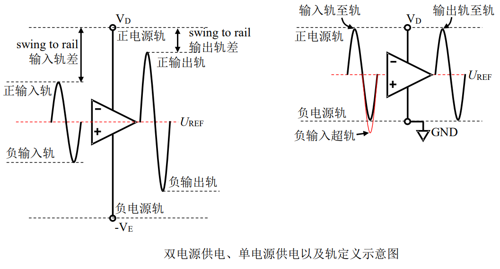

# 
 输入电压范围
> 
Input Voltage Range

## 定义：
保证运算放大器正常工作的最大输入电压范围。
也称为共模输入电压范围。  

## 优劣范围：
一般运放的输入电压范围比电源电压范围窄 1V 到几 V，比如±15V 供电，输入电压范围在-12V~13V。

较好的运放输入电压范围和电源电压范围相同，甚至超出
范围 0.1V。比如±15V 供电，输入范围在-15.1V 到 15.0V，这会使得放大器设计具有更大的输入动态范围，提高电路的适应性。

>当运放最大输入电压范围与电源范围比较接近时，比如相差 0.1V 甚至相等、超过，都可以叫“输入轨至轨”，表示为 Rail-to-rail input，或 RRI。 

## 示意图：

