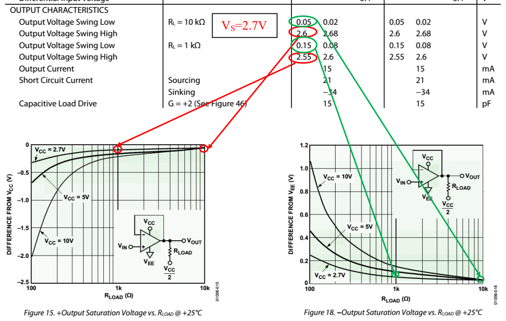

# 
 输出电压范围($V_{OH}/V_{OL}$)
> 
Swing from rail

## 定义：
在给定电源电压和负载情况下，输出能够达到的最大电压范围。

或者给出正向最大电压 VOH 以及负向最小电压 VOL——相对于给定的电源电压和负载；

或者给出与电源轨（rail）的差距。 

## 优劣范围：
一般运放的输出电压范围要比电源电压范围略窄 1V 到几 V。较好的运放输出电压范围可以与电源电压范围非常接近，比如几十 mV 的差异，这被称为“输出至轨电压”。这在低电压供电场合非常有用。

> 当厂家觉得这个运放的输出范围已经接近于电源电压范围时，就自称“输出轨至轨”，表示为 Rail-to-rail output，或 RRO。

## 理解：
在没有额外的储能元件情况下，运放的输出电压不可能超过电源电压范围，随着负载的加重，输出最大值与电源电压的差异会越大。这需要看数据手册中的附图。

## 示意图：
下图摘自可 2.7V 供电的 80MHz，RRIO（输入输出均轨至轨）放大器 AD8031。其输入范围超出了电源(0~2.7V)，为-0.2V~2.9V，输出非常接近电源，为 0.02V 到 2.68V，仅有20mV 的至轨电压。

## 输出至轨电压特点：
1. 正至轨电压与负至轨电压的绝对值可能不一致，但一般情况下数量级相同； 
2. 至轨电压与负载密切相关，负载越重（阻抗小）至轨电压越大； 
3. 至轨电压与信号频率相关，频率越高，至轨电压越大，甚至会突然大幅度下降； 
4. 至轨电压在 20mV 以内，属于非常优秀。
