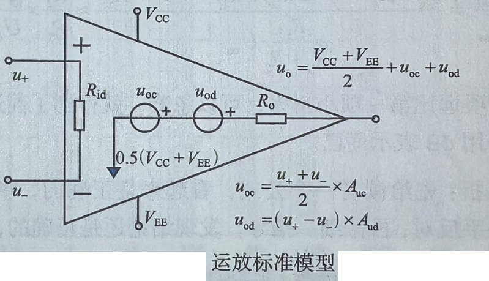
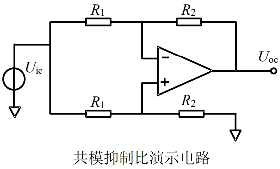

# 
 共模抑制比(CMRR)
> 
Common-mode rejection ratio

## 定义：
运放的差模电压增益与共模电压增益的比值，用 dB 表示。
$$
CMRR = 20 log(\frac{A_d}{A_c})
$$
> 共模: Common-mode
> 差模: Differential-mode

## 优劣范围：
一般运放都有 60dB 以上的 CMRR，高级的可达 140dB 以上。  

## 理解：
运算放大器在单端输入使用时，CMRR对输出的影响十分微弱，一般不存在这个概念。只有把运放接成类似于减法器形式，使得运放电路具备两个可变的输入端时，此指标才会发挥作用。 

## 示意图：
运放角度：

电路角度：

$$
A_d = \frac{R_2}{R_1}       \\
A_c = \frac{U_{oc}}{U_{ic}} \\
CMRR = 20 log(\frac{\frac{R_2}{R_1}}{\frac{U_{oc}}{U_{ic}}}) = 20 log(\frac{U_{ic}}{\frac{U_{oc}}{A_d}})
$$

## 电路角度CMRR推导(标准运放)：
$$
\begin{cases}
U_- = \frac{R_1}{R_1 + R_2}U_{oc} + \frac{R_2}{R_1 + R_2}U_{ic} \\
U_+ = \frac{R_2}{R_1 + R_2}U_{ic}
\end{cases}
$$
运放内部受控电压源
$$
u_{od} = A_{ud} (u_+ - u_-) = -A_{ud} \frac{R_1}{R_1 + R_2}U_{oc}
$$

$$
u_{oc} = A_{uc} \frac{u_+ + u_-}{2}= A_{uc} \frac{R_2}{R_1 + R_2}U_{ic} + A_{uc} \frac{R_1}{2 (R_1 + R_2)}U_{oc}
$$

$$
U_{oc} = u_{od} + u_{oc}
$$

将$A_{ud} 和 A_{uc}$放到两边，得到关系：
$$
CMRR = \frac{A_{ud}}{A_{uc}} = \frac{\frac{R_2}{R_1 + R_2}U_{ic} (+ \frac{R_1}{2 (R_1 + R_2)}U_{oc} - \frac{U_{oc}}{A_{u_c}})}{\frac{R_1}{R_1 + R_2}U_{oc}} \approx \frac{R_2}{R_1} \frac{U_{ic}}{U_{oc}}
$$

>括号内的两项，比前面一项要小得多，可以忽略。
>这个是比值，没带单位，换算成dB单位，就要加上20log

## 影响因素：
