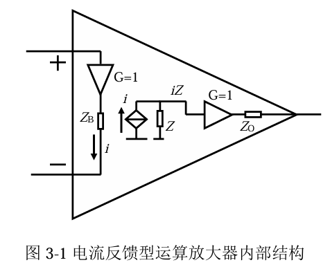

# 
电压反馈型运算放大器(VFA)
> Voltage Feedback Amp

特征：
1. 虚断（同相和反向输入端 输入电阻无限大）
2. 虚短（在引入负反馈中，同相和反相的电压相等）

# 
电流反馈型运算放大器(CFA)
> Current Feedback Amp

特征：
1. 正输入端是高阻输入的，等效为一个增益为1的跟随器
2. 负输入端的输入电阻很低(一般为几十Ohm)
3. 输入端的电压差与内部电阻形成的电流i，在输出端，电流源i和一个电阻Z并联接入输出端iZ

> 尽管两者在外部特性表现相似，谨慎使用CFA来替换VFA

CFA相较于VFA的特点：
当增益上升时，带宽下降微弱

推荐：
ADA4870-1
单位增益稳定，高速，电流反馈型放大器，能够提供1A的连续输出电流

