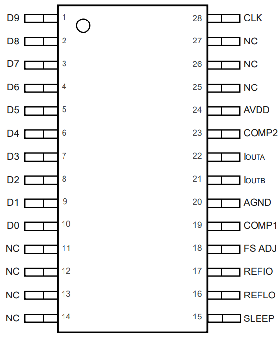

# 
引脚配置和功能
# 
Pin Configuration and Functions

|引脚序列       |引脚名称     |描述
|:---:          |:---:        |:---:
|1              |DB9          |MSB
|2~9            |DB8~DB1      |数据位1~8
|10             |DB0          |LSB
|11~14,25       |NC           |无内部连接
|15             |SLEEP        |开关。高电平有效（内置下拉）
|16             |REFLO        |$接入ACOM时，启用内部基准，作为参考地\\接入AVDD时，禁用内部基准$
|17             |REFIO        |$禁用内部基准时，作为参考输入\\使用内部基准时，作为1.1V的参考输出，需要和ACOM接0.1uF电容$
|18             |FS ADJ       |满偏电流输出调整
|19             |COMP1        |带宽/噪声抑制节点，和AVDD接0.1uF电容
|20             |ACOM         |模拟公共端
|21             |IOUTB        |互补DAC电流输出，当数据位全为0时，输出满偏电流
|22             |IOUTA        |DAC电流输出，当数据位全为1时，输出满偏电流
|23             |COMP2        |用于控制驱动电路的内部偏置节点，必须和ACOM有一个至少为100uF的去耦电容
|24             |AVDD         |模拟电源电压+2.7~5.5V
|26             |DCOM         |数字公共端
|27             |DVDD         |数字电源电压+2.7~5.5V
|28             |CLK          |时钟输入（在上升沿被锁存）

### 
DAC控制原理
通过数据位DB1~8的输入，决定 DAC_Code 大小，最大255；

$
I_{outA} = (DAC\_Code / 256) * I_{outFS}     \\
I_{outB} = (256 - DAC\_Code / 256) * I_{outFS} 
$

注意$I_{outFS}$是参考电流$I_{REF}$的函数，$I_{REF}$名义上由参考电压$V_{REFIO}$和外部电阻$R_{SET}$决定：

$$
I_{outFS} = 32I_{REF}
$$

其中：

$
I_{REF} = \frac{V_{REFIO}}{R_{SET}}             \\
V_{outA} = I_{outA} R_{Load}                    \\
V_{outB} = I_{outB} R_{Load}
$

>注意：$V_{outA} 和 V_{outB}$不能超出规定的输出范围（-1.0~1.25）

在$I_{outA} 和 I_{outB}$之间的差分电压为：
$$
V_{diff} 
= (I_{outA} - I_{outB}) R_{Load}    
= \frac{2 DAC\_Code - 255}{256} * 32 * \frac{R_{Load}}{R_{SET}} * V_{REFIO}
$$

\\
\\

### 
量程
>“ ~ ”表示范围。如果没有，表示为经典值。
#### 引脚
|对象           |参考           |值
|:---:          |:---:          |:---:
|VDD            |ACOM           |-0.3 ~ 6.5 V
|DVDD           |DCOM           |-0.3 ~ 6.5 V
|ACOM           |DCOM           |-0.3 ~ 0.3 V
|AVDD           |DVDD           |-6.5 ~ 6.5 V
|               |               |
|               |               |

#### 模拟输出
输出电流（满偏）：
- 2 ~ 20    mA

输出电压：
- -1.0 ~ 1.25   V

输出电阻：
- 100    K$\Omega$

输出电容：
- 5   pF

#### 参考输出
参考电压$V_{REF}$：
- 1.08 ~ 1.12   V

参考输出电流$I_{REF}$：
- 100   nA

#### 电源
|对象           |值
|:---:          |:---:
|AVDD           |2.7 ~ 5.5 V
|DVDD           |2.7 ~ 5.5 V
|               |
