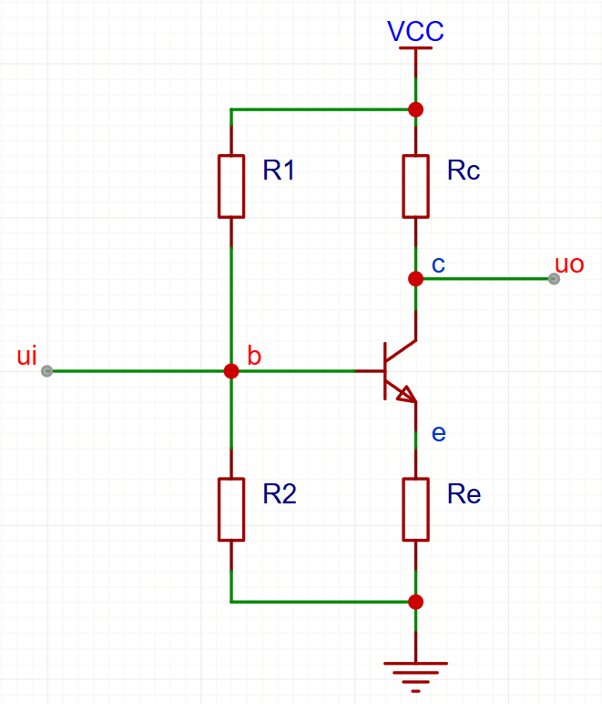

# 
基本共射放大电路

## 直流分析工作状态：
- 假定正常工作

$$
u_b =  \frac{R2}{R1 + R2}V_{CC}     \\
u_e = u_b - 0.6                     \\
i_e = \frac{u_e}{R_e}               \\
i_c = \frac{\beta}{\beta + 1}i_e    \\
u_c = V_{CC} - i_c R_c
    = V_{CC} - \frac{\beta}{\beta + 1}\frac{R_c}{R_e}(u_b - 0.6)
$$

 通常情况下，$\beta$ 非常大，所以
$$ u_c = V_{CC} - \frac{R_c}{R_e}(u_b - 0.6)$$

> 通过电流值（及其功率计算），可以预防三极管烧坏
> 基极电压揭示三极管工作状态

## 交流分析放大状态：

$$
对于交流电路，基极与发射极在导通时，电阻为0，即\\
u_e = u_i                   \\
基于\begin{cases}
    i_e = \frac{u_e}{R_e}   \\
    i_c = i_e               \\
    u_c = i_c R_c    
\end{cases}                 \\
u_o = u_c =\frac{R_c}{R_e}u_i\\
A_u = \frac{u_o}{u_i} = \frac{R_c}{R_e}
$$

