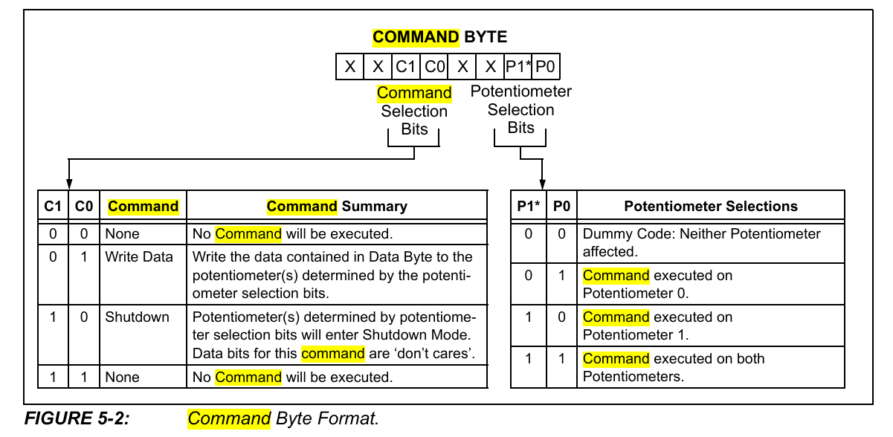

# 
MCP41xxx

### 7脚芯片（只有一个电位器Pot 0）

1. $\overline{CS}$
2. SCK
3. SI
4. $V_{SS}$
5. PA0(端点A)
6. PW0(AB之间的滑片wiper)
7. PB0(端点B)
8. $V_{DD}$

### 14脚芯片（有两个电位器，只提一嘴，不细讲）

关于SO脚：
1. 推挽输出
2. 在SCL的下降沿改变
3. 在$\overline{CS}$为高电平时，SO输出为逻辑低电平

关于$\overline{RS}$脚：
1. 持续150ns以上的低电平，会使所有的电位器置中位
2. 不要浮空

### 信号过程：

- 上升沿写入

### 指令代码：

> 前八位（指令位）

XX C1 C0 XX P1 P0

操作：（C1 C0）
1. 00：无操作
2. 01：写入数据
3. 10：关闭
4. 11：无操作

选择：（P1 P0）
1. 00：无选择
2. 01：电位器0
3. 10：电位器1
4. 11：所有电位器

> 后八位（数据位）

高位先行，共八位

