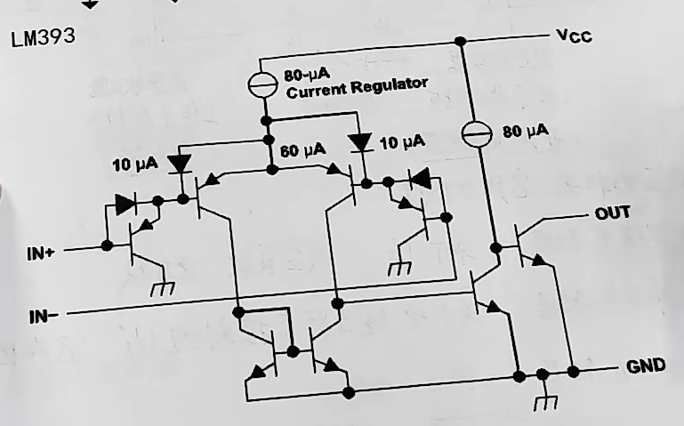

# 一、基本参数

- $U_{OH}$ 输出电压高值
- $U_{OL}$ 输出电压低值
- $U_{t}$  跃变阈值电压

# 二、电路分类与特点

1. 单限比较器

- 单个$U_{t}$
- 反应灵敏（不稳定，抗干扰弱）
- 速度快

2. 滞回（迟滞）比较器

- 两个受输出状态控制的$U_{t}$

3. 窗口比较器

# 三、内部结构（LM393为例）
> 不同电压比较器，内部情况可能不一样，要自己去要一下结构

要注意输出的状态，这个就是开漏输出
- 输出最后一个三极管，导通时，相当于接地，输出为0
- 当截止时，输出悬空。所以可以接一个上拉电阻来控制截止时的状态。