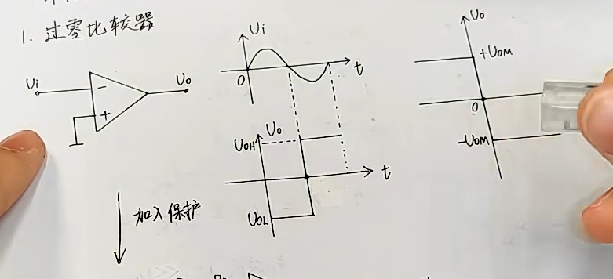
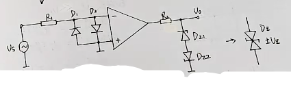
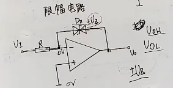
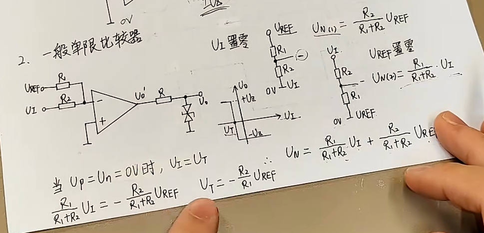
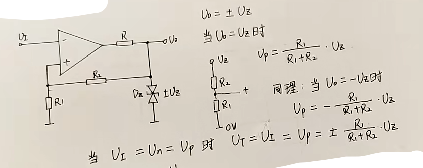
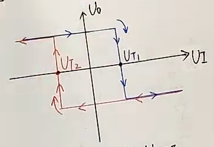

# 基本原理：过零比较器

最右边的图，是输入和输出电压的关系
- 当反相端 > 同相端电压时，输出为低电压
- 当反相端 < 同相端电压时，输出为高电压
- 当反相端 = 同相端电压时，输出准备跳变

### 保护电路

常见电路：

1. 输入保护：
   - 用二极管做钳位，导通时，压降小，有稳定正反相的压差的作用

2. 输出保护
   - 用稳压管来钳制输出电压（与稳压值Uz有关，使输出在-Uz ~ +Uz之间）
   - R2电阻是用来限流保护稳压管

限幅电路：

- 说白了，就是输出电压大于稳压管的稳压值Uz时，稳压管导通，使得运放形成负反馈，输出在+-Uz之间。

# 一、一般单限比较器

分析：
1. 得到同相端的电压（叠加定理）
   - 分别将 ==参考电压Vref== 和 ==输入电压Vi== 进行置零
   - $U_n = \frac{R_1}{R_1 + R_2}U_i + \frac{R_2}{R_1 + R_2}U_{ref}$

2. 得到参考电压和输入电压的关系，判断跳变电压($U_t = U_i$)
   - 当 $U_p = U_n = 0$ 时，$U_t = -\frac{R_2}{R_1}U_{ref}$

3. 其实也可以在同相端加参考电压
   

# 二、滞回（迟滞）比较器

稳压管：钳制电压在

分析：
1. 得到正相端电压关系,当 $U_o = \pm U_z$ 时

   $$U_p = \pm \frac{R_1}{R_1 + R_2}U_z$$

2. 求跳变电压$U_t$，即 $U_p = U_n$ 时

3. 通过假设不同情况，来分析变化：

> 注意：
> 1. 当输出电压发生变化时，会影响到稳压管的钳制电压
> 2. 如果想要使 $U_t$ 不对称，可以在输入端加上参考电压
> 3. 改变跳转方向，可以对换输入方向

