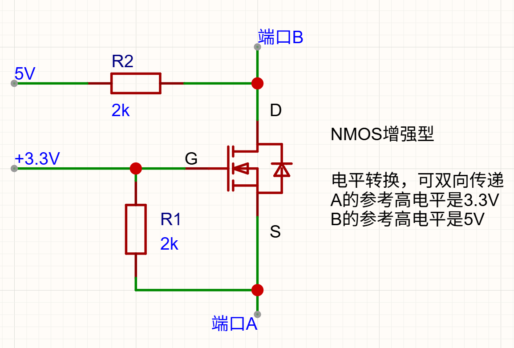

# 
电平转换
> Leve_Transformation

### 示意图

### 器件
绝缘栅NMOS增强型场效应管

### 作用
即使双方参考电平不同，也能双向通信

### 原理

- 当端口A输入为高电平（3.3V）时，$V_{GS} = 0$,  MOS关断，端口B输出为5V。
- 当端口A输入为低电平（0V）时，$V_{GS} = 3.3V$，MOS导通，端口B输出为0V。

- 当端口B输入为高电平（5V）时，MOS状态只与$V_{GS}$有关。此时，端口A相当于只是接入一个上拉电阻，所以端口A输出为3.3V。
- 当端口B输入为低电平（0V）时，3.3V电源经过R1到S源端，通过DS体电阻，再到D漏端（相当于地）存在回路，S源端为0.7V（体二极管压降）。此时，$V_{GS} = 2.6V$，MOS导通，使得S源端为0V。所以端口A输出为0V。

