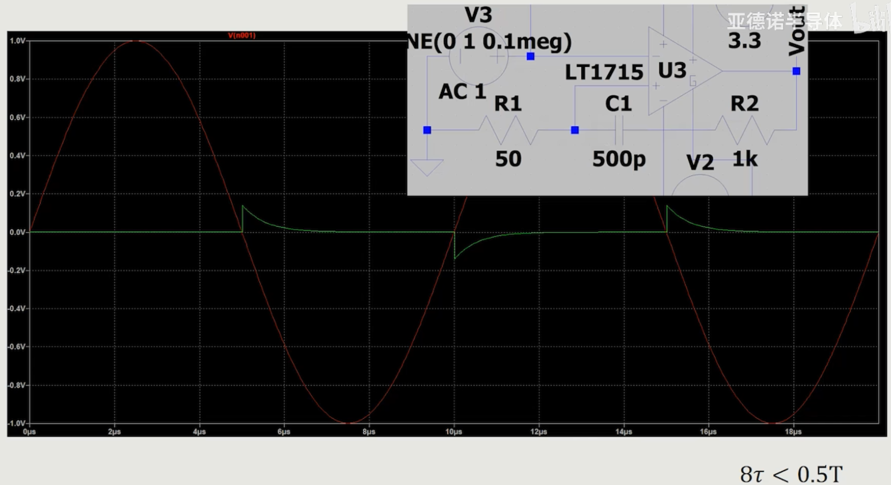

比较器翻转的时候，可能会出现抖动，主要原因是
1. 输入信号不干净
2. 电源去耦不合适
3. 地平面不够稳定
4. 缺少合适的迟滞电路

加入迟滞电路，可能会影响地平面，从而影响占空比。
使用动态迟滞电路（加电容）会更好

例如：

这里绿色线表示基准
回复常数为(R1 + R2) * C1
迟滞：把输出引入到正输入

进入比较器的正弦波幅度，最好超过100mV，以避免比较器过驱电压不够带来的延时变化。
