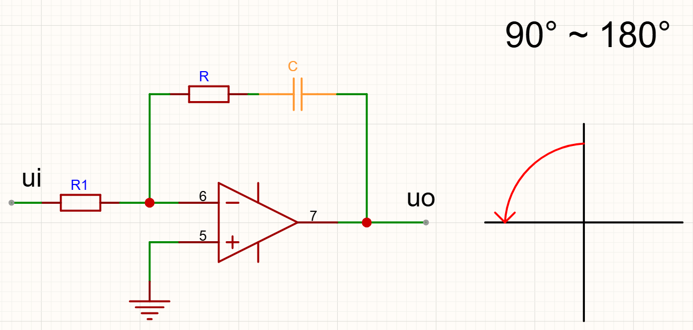
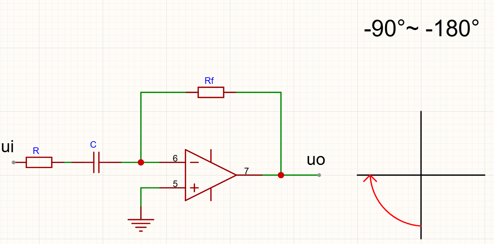
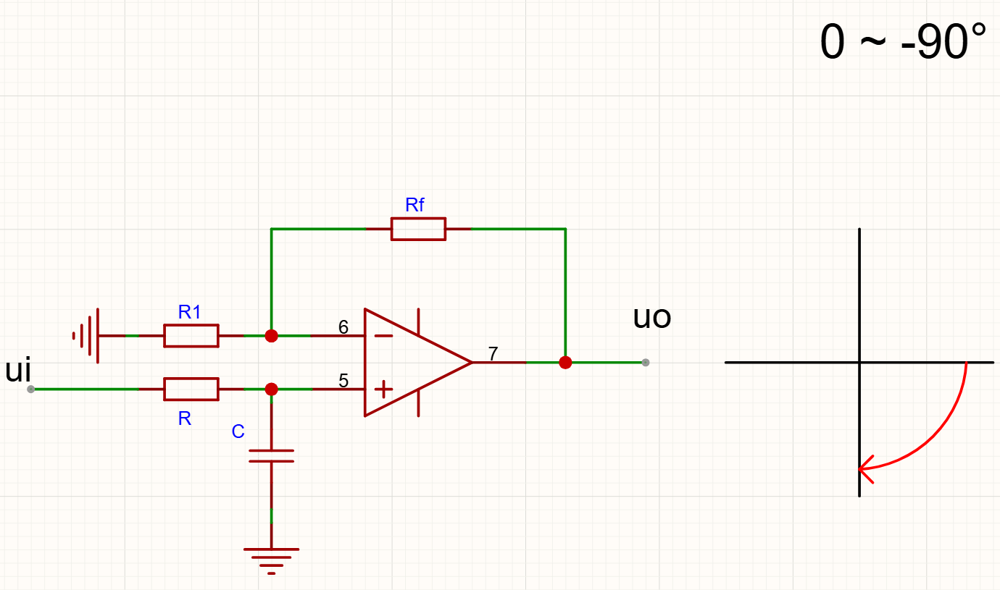
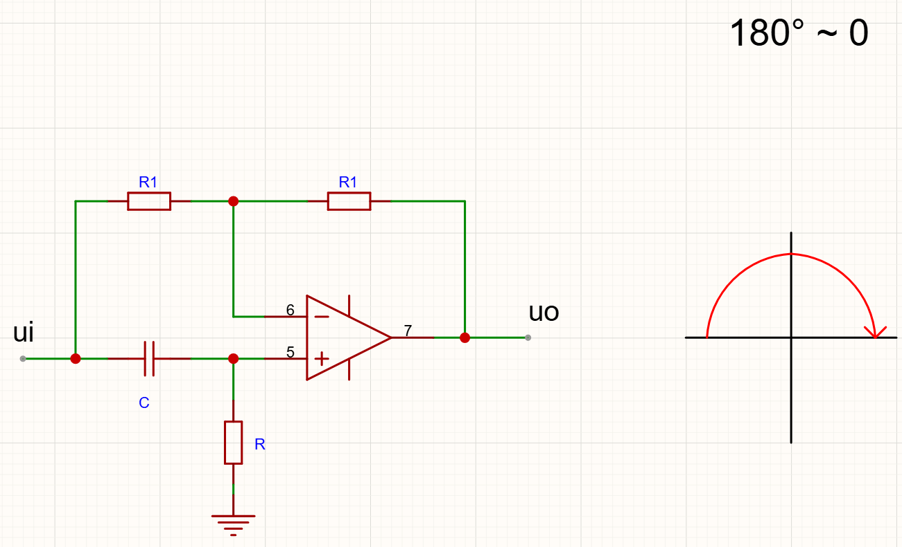
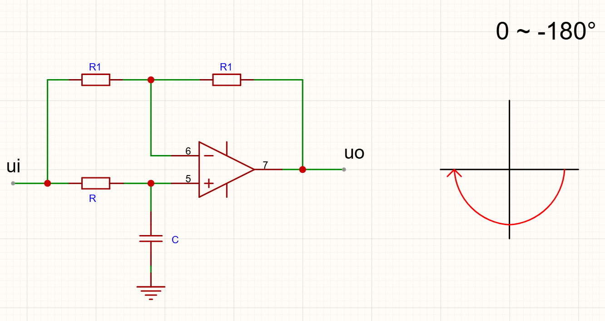

# 
RC移相器概述

我们默认C不变，R可调。

为了方便调节，我们通过R来控制相位，变化设置如下：

R：0 -> $\infty$

> 电路相移，实际上受频率，电阻R，和电容C影响

# 
90° 移相器

### 第一象限：$90^\circ$ ~ 0

$$
u_o = (1 + \frac{R_f}{R_1}) (\frac{R}{R + \frac{1}{jwC}}) u_i
$$

$$
A_u = (1 + \frac{R_f}{R_1}) (\frac{jwRC}{1 + jwRC})
$$

$$
\Delta \varphi = 90^\circ - \arctan(wRC)
$$

$$
\varphi \in (90^\circ , 0)
$$

### 第二象限：$90^\circ$ ~ $180^\circ$

$$
u_o = (- \frac{R + \frac{1}{jwC}}{R_1}) u_i
$$

$$
A_u = (- \frac{1 + jwRC}{jwR_1C})
$$

$$
\Delta \varphi = 180 + \arctan(wRC) - 90^\circ
$$

$$
\varphi \in (90^\circ , 180^\circ)
$$

### 第三象限：-$90^\circ$ ~ -$180^\circ$

$$
u_o = (- \frac{R_f}{R + \frac{1}{jwC}}) u_i
$$

$$
A_u = (- \frac{jwR_fC}{1 + jwRC})
$$

$$
\Delta \varphi = -180 + 90^\circ - \arctan(wRC)
$$

$$
\varphi \in (-90^\circ , -180^\circ)
$$

### 第四象限：0 ~ -$90^\circ$

$$
u_o = (1 + \frac{R_f}{R_1}) (\frac{\frac{1}{jwC}}{R + \frac{1}{jwC}}) u_i
$$

$$
A_u = (1 + \frac{R_f}{R_1}) (\frac{1}{1 + jwRC})
$$

$$
\Delta \varphi = 0 - \arctan(wRC)
$$

$$
\varphi \in (0 , -90^\circ)
$$

# 
180° 移相器

### $180^\circ$ ~ 0

$$
u_o = (1 + \frac{R_1}{R_1}) (\frac{R}{R + \frac{1}{jwC}}) u_i + (- \frac{R_1}{R_1}) u_i
$$

$$
A_u = 2 (\frac{jwRC}{1 + jwRC}) - 1
$$

$$
A_u =  - \frac{1 - jwRC}{1 + jwRC}
$$

$$
\Delta \varphi = 180^\circ - 2\arctan(wRC)
$$

$$
\varphi \in (180^\circ , 0)
$$

### 0 ~ -$180^\circ$

$$
u_o = (1 + \frac{R_1}{R_1}) (\frac{\frac{1}{jwC}}{R + \frac{1}{jwC}}) u_i + (- \frac{R_1}{R_1}) u_i
$$

$$
A_u = 2 (\frac{1}{1 + jwRC}) - 1
$$

$$
A_u = \frac{1 - jwRC}{1 + jwRC}
$$

$$
\Delta \varphi = - 2\arctan(wRC)
$$

$$
\varphi \in (0 , -180^\circ)
$$