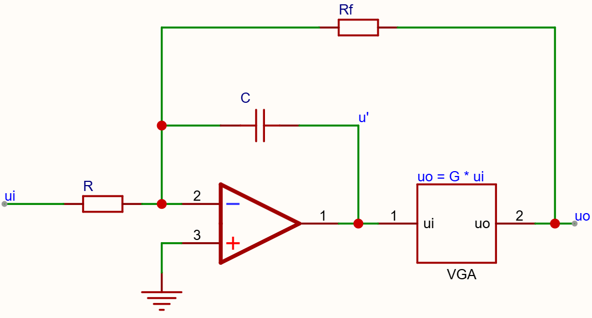
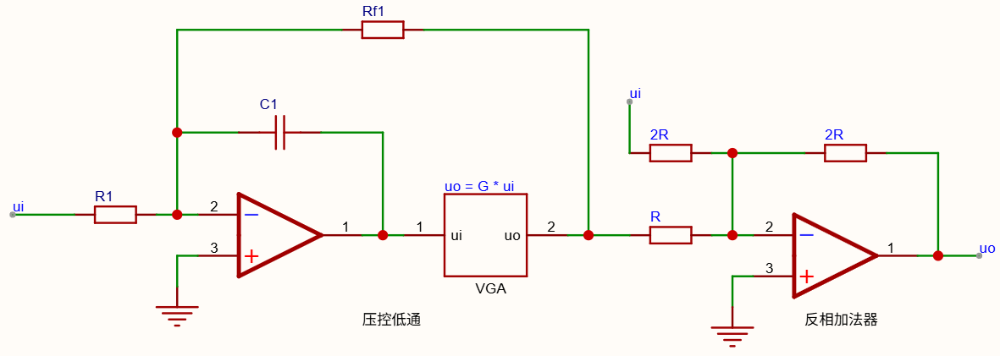

# 
压控移相器

### 使用说明

输入前，最好先衰减到一定值，因为可能存在中途受限问题。
输入频率不能太低

### 压控低通示意图

### 原理

$$
\begin{cases}
\frac{u_o}{R_f} + \frac{u'}{\frac{1}{jwC}} + \frac{u_i}{R} = 0  \\
u_o = G \cdot u'
\end{cases}
$$

$$
u_o = -\frac{R_f}{R} \cdot \frac{1}{1 + \frac{jwR_fC}{G}} \cdot u_i
$$

$$
u_o = -\frac{R_f}{R} \cdot \frac{1}{1 + j\frac{f}{f_0}} \cdot u_i
$$

$$
A_{LP} = -\frac{R_f}{R} \cdot \frac{1}{1 + j\frac{f}{f_0}} \cdot
$$

$$
f_0 = -\frac{G}{2\pi R_fC}
$$

### 将低通转换为全通原理：

$$
A_{AP} = \frac{1 - j\frac{f}{f_0}}{1 + j\frac{f}{f_0}} = \frac{2}{1 + j\frac{f}{f_0}} - 1 = 2A_{LP} - 1
$$

> 如果用压控低通 转化成 压控全通，注意$A_{LP}$符号正负

### 压控全通示意图

$$
A_{u} = \frac{u_o}{u_i} = -( -2A_{LP} + 1) = 2A_{LP} - 1
$$

> 如果感觉G控制不够敏感，可以再串上一级VGA，即增益为$G^2$

