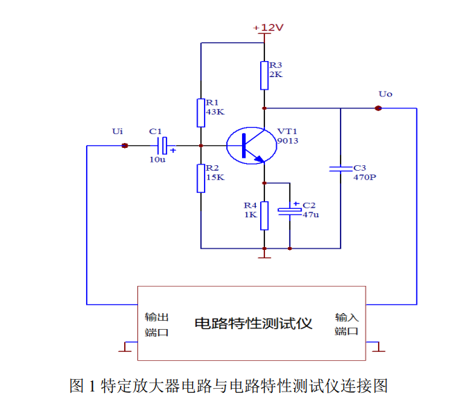

# 简易电路特性测试仪

### 基本要求
1. 输入电阻
2. 输出电阻
3. 增益
4. ==幅频特性==

### 进阶要求
1. 电阻 开路或短路
2. 电容 开路
3. 电容 两倍
4. 判断速度 < 2s

现象：
1.LTspice
|情况           |输入电压（V）        |输出电压（V）
|:---:          |:---:                |:---:
|1              |                     |
|R1电阻开路     |输入                 |12（DC）
|R1电路短路     |输入                 |11.1（DC）
|2              |                     |
|R2电阻开路     |输入                 |4.1~5.3（截止失真）
|R2电路短路     |输入                 |12（DC）
|3              |                     |
|R3电阻开路     |                     |0.212~（AC）
|R3电路短路     |                     |12（DC）
|4              |                     |
|R4电阻开路     |                     |12（DC）
|R4电路短路     |                     |0~2.7（截止失真）

1.Multisim
|情况           |输入稳态交流电流（uA）    |输出电压（V）
|:---:          |:---:                |:---:
|1              |                     |
|R1电阻开路     |1.4                  |12（DC）
|R1电路短路     |5.6                  |11.1（DC）
|2              |                     |
|R2电阻开路     |5.58                 |4.1~5.3（截止失真）
|R2电路短路     |输入                 |12（DC）
|3              |                     |
|R3电阻开路     |                     |0.212~（AC）
|R3电路短路     |                     |12（DC）
|4              |                     |
|R4电阻开路     |                     |12（DC）
|R4电路短路     |                     |0