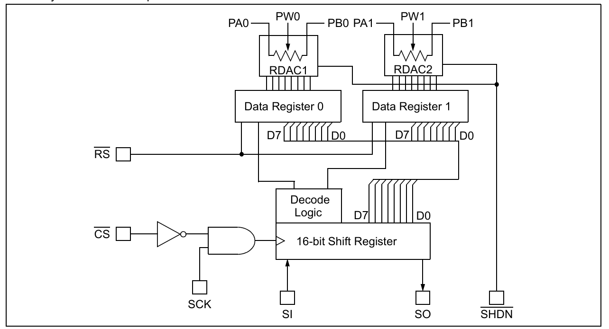
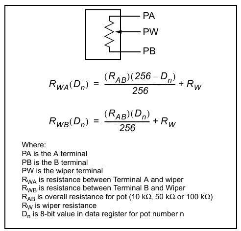
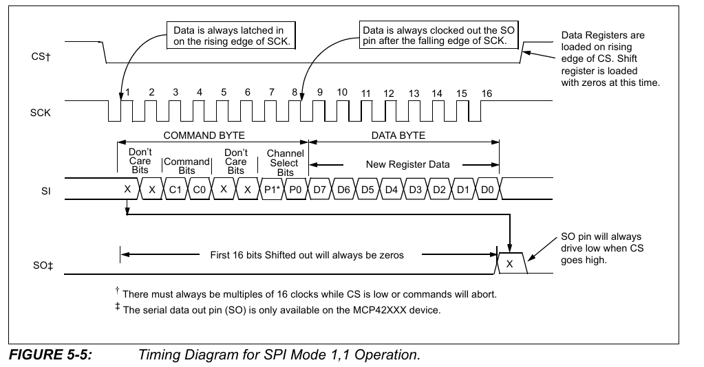

# 
数字电位器
> digital potentiometer

## 市场调研

#### MCP41xxx(单数字电位器)

虽然官方成本价为15上下；但是国内生产较多，所以比较便宜，可以为4~6

#### MCP42xxx(双数字电位器)

太贵了，官方一个成本20；应该是国内生产较少，所以比较贵。

# 
MCP41xxx
> 八位数字电位器

### 7脚芯片（只有一个电位器Pot 0）

1. $\overline{CS}$
2. SCK
3. SI
4. $V_{SS}$
5. PA0(端点A)
6. PW0(AB之间的滑片wiper)
7. PB0(端点B)
8. $V_{DD}$

### 14脚芯片（有两个电位器）

1. $\overline{CS}$
2. SCK
3. SI
4. $V_{SS}$
5. PB1(电位器1的端点B)
6. PW1(电位器1，AB端点之间的滑片wiper位置)
7. PA1(电位器1的端点A)
8. PA0
9. PW0
10. PB0
11. $\overline{RS}$
12. $\overline{SHDN}$
13. SO
14. $V_{DD}$

关于$\overline{CS}$ 1脚：（Chip Select）
1. 输入内置施密特触发器
2. 在它加载进移位寄存器后，开始执行新命令

关于$\overline{RS}$ 11脚：（Reset）
1. 持续150ns以上的低电平，会使所有的电位器置中位
2. 当$\overline{CS}$为低电平时，不要调低RS状态
3. 不要浮空

关于$\overline{SHDN}$ 12脚：（Shutdown）
1. 当这个为低电平时，设备会进入低能耗模式，A opened，BW相连
2. 当$\overline{CS}$为低电平时，不要调低SHDN状态
3. 输入内置施密特触发器
4. 不要浮空

关于SO 13脚：
1. 推挽输出
2. 在SCL的下降沿改变
3. 在$\overline{CS}$为高电平时，SO输出为逻辑低电平
4. 可作为菊花链式输出（多个MCP42的时候，可以考虑使用）

##### 示意图

#### 注意事项（设计推荐）

1. 电位器的滑片是有内阻的，10K Ohm的为52 Ohm；50/100K Omh的为125 Ohm。
2. 最大电源电压是7V（单电源供电2.7~5.5V，推荐为3.3V）
3. ESD保护 > 2kV
4. 最大时钟是10MHz
5. 很多IO口都是施密特触发器，0.7VDD为高电平，0.3VDD为低电平，所以电源应该选择为3.3V。注意，IO口的输入范围为-0.6V~VDD + 1V
6. 注意CS，RS，SHDN都是低电平有效
7. 阻值：MCP4X010： 10k Ohm ；MCP4X050 ： 50k Ohm ； MCP4X100：100K Ohm
8. 过不了大电流。为了保证电位器不被损坏，电流应该不超过1mA
9. 根据输入值从小到大，滑片从B到A，

### 信号过程：

- 上升沿写入

### 指令代码：

> 前八位（指令位）

XX C1 C0 XX P1 P0

操作：（C1 C0）
1. 00：无操作
2. 01：写入数据
3. 10：关闭
4. 11：无操作

选择：（P1 P0）
1. 00：无选择
2. 01：电位器0
3. 10：电位器1
4. 11：所有电位器

> 后八位（数据位）

高位先行，共八位

