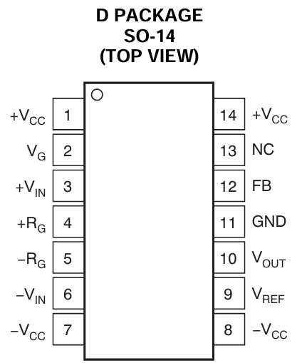
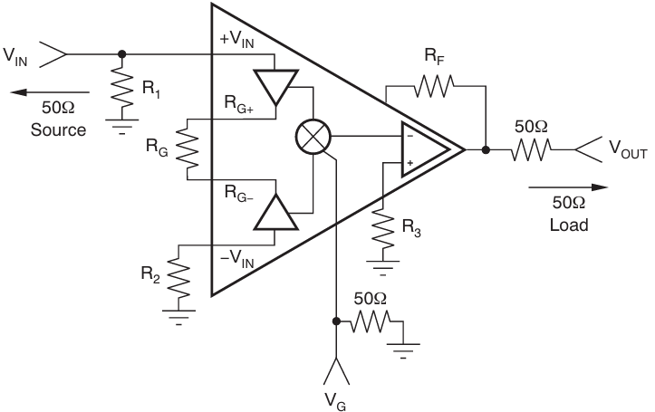
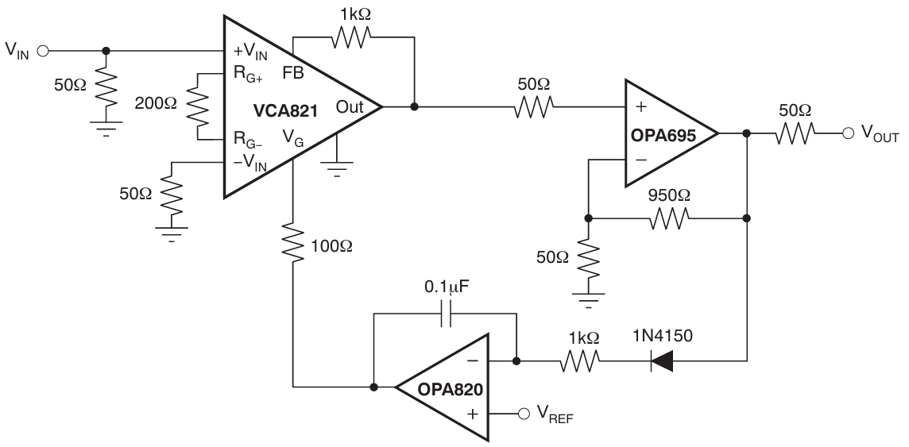
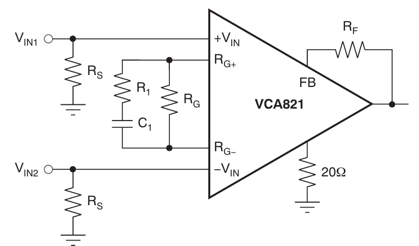
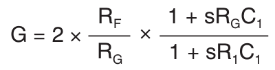
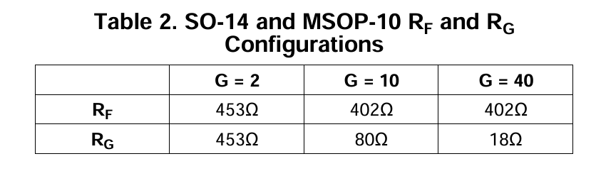

CFA 型器件，反馈会影响带宽

### 引脚示意

- $V_{REF}$ (P9)

该引脚必须通过一个20电阻连接到地，以避免可能的输出级振荡。

### 典型电路

- VGA (这个实际上是测试电路)

- AGC

### 使用说明

增益分为两部分

- 电阻网络增益（运放反馈）

最大增益应该在6~32 (dB)之间（2~40倍电压增益）

典型使用：

- 电压增益（VG）

从0 ~ 2V（-20 ~ 20 dB）

### PCB建议

- 最小化IO的寄生电容：放置一个小的串联电阻（大于25Ω），输入引脚连接到地，以帮助解耦封装寄生

### 备注

1. 用洞洞板搞，效果很差，容易出现自激振荡（290~330MHz）

